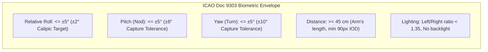
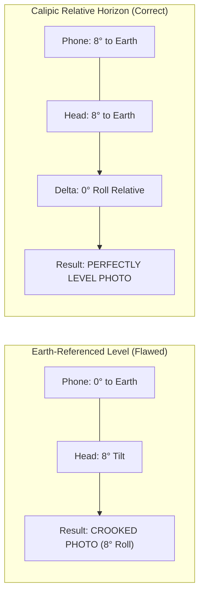
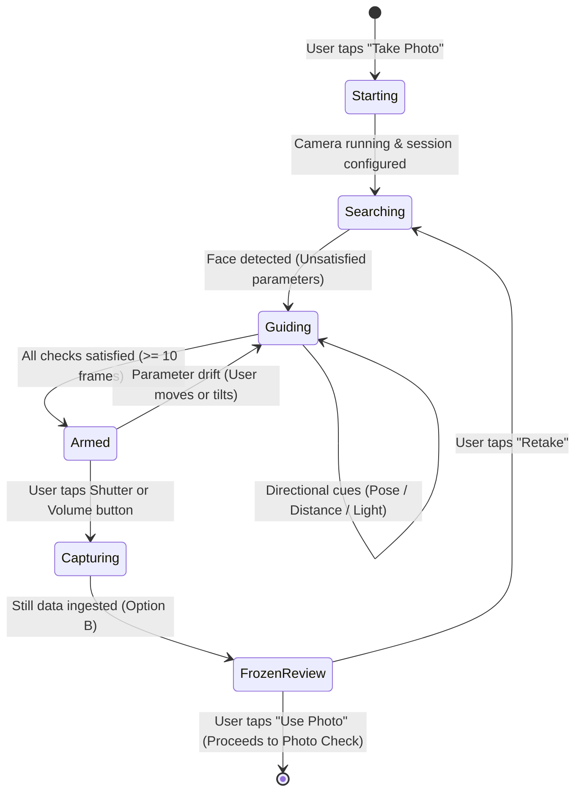

# 18 — Guided Biometric Selfie Experience: Deep Research & Technical Specification

**Status:** Design research; ADR-045 and screen spec §6.1 supersede its proposed readiness arming, timing, and verification effects
**Scope:** Research proposals for in-app selfie capture and still review. The accepted implementation choices are in ADR-045 and screen spec §6.1.
**Standards Covered:** ICAO Doc 9303, ISO/IEC 19794-5, ISO/IEC 39794-5, Apple Human Interface Guidelines, Apple Vision & CoreMotion
**Target Codebase:** `Spikes/IDPhotoSpike/App/Camera/*`, `docs/16-screen-experience-spec.md §6`, `docs/spikes/05-guided-camera.md`
**Date:** 2026-09-28

---

**Implementation decision (2026-09-30):** Prototype only a gentle outer dim and subtle eye-level line, then assess them on a physical phone. Keep manual shutter and optional three-second automatic capture. On capture completion, show the actual still with Retake and Use Photo, without compliance chips. The detailed proposals below remain research rather than an implementation contract.

---

## 1. Executive Summary & Problem Space

### 1.1 The Challenge in Mobile ID Photography
Capturing an official identity or passport-grade photo on a mobile device presents a fundamental paradox:
1. **Strict Regulatory Standards (ICAO 9303):** Official documents require a frontal, distortion-free portrait with eyes level (<= ±5° yaw/pitch/roll), uniform diffuse lighting, no shadows, neutral expression, and strict head-to-frame dimensional ratios.
2. **Mobile Ergonomic & Optical Reality:** Users hold smartphones at arm’s length with wide-angle front lenses (23–24 mm equivalent), tilted upward from chest height (15° - 30° pitch error), with head tilted relative to the hand, under uneven indoor lighting, while struggling to stabilize a 200-gram phone.

### 1.2 The Failure of Naive Implementations
Standard camera implementations fail users in three ways:
* **Passive Viewfinder:** A static thin oval over an edge-to-edge camera feed gives no sense of depth, leaving users guessing whether they are too close or too far.
* **Cognitive Overload via Text Prompts:** Rapidly flashing instructions (*"Tilt phone up"*, *"Rotate left"*, *"Hold level"*) confuse users because spatial orientation in a mirrored selfie mirror cannot be easily solved through reading.
* **Premature Auto-Capture or Shaky Shutter Tap:** Fully automatic capture snaps before the user settles their expression; conversely, a heavy button tap introduces 2° - 6° rotational camera shake and diverts eye gaze away from the lens.

### 1.3 Calipic Target Architecture
This specification establishes a **best-in-class biometric capture flow**:
* **Aperture Scrim Masking:** Frosted/darkened peripheral scrim isolating the face aperture.
* **Relative Head-to-Phone Horizon:** An intuitive visual eye-level reticle measuring the angle between the head and phone, magnetically snapping level when aligned.
* **Shutter-Assisted Capture:** The user retains full control; the shutter button and guides act as an intelligent arming system, turning vibrant emerald green when all parameters pass.
* **Option B — Instant Freeze-Frame Review:** High-speed capture freezing on the still frame within the aperture, offering instantaneous, unambiguous **"Use Photo"** and **"Retake"** actions.

---

## 2. Regulatory & Biometric Foundations (ICAO Doc 9303 & ISO/IEC 19794-5)

Official passport and national ID card (such as the Spanish DNI) standards govern the acceptable tolerance envelope. The guided camera must coach the user into this envelope *before* the shutter is pressed.



### 2.1 Pose & Geometric Tolerances
* **Relative Roll (Ear-to-Shoulder Tilt):**
  * *ICAO Specification:* <= ±8° allowable; automated face recognition systems degrade above ±5°.
  * *Calipic Real-Time Goal:* Enforce <= ±2.0° relative roll for the magnetic snap, with a fallback tolerance of <= 5.0°. (The downstream crop solver levels up to 15°, but capturing level prevents perspective skew).
* **Pitch (Up/Down Nod):**
  * *ICAO Specification:* <= ±5°. Upward pitch exposes nostrils and under-chin; downward pitch hides neck contours and distorts forehead proportions.
  * *Calipic Real-Time Goal:* Enforce |Pitch| <= 8°. If the phone is held low and tilted up, coach *"Raise phone to eye level"*.
* **Yaw (Left/Right Rotation):**
  * *ICAO Specification:* <= ±5°. Both ears, both eyes, and cheek contours must be symmetrically visible.
  * *Calipic Real-Time Goal:* Enforce |Yaw| <= 10°. Beyond this, prompt *"Look straight at the camera"*.
* **Interpupillary Distance (IOD) & Head Ratio:**
  * *ICAO Specification:* Crown-to-chin distance must occupy 70% - 80% of the final portrait height; inter-eye distance must exceed 90 pixels (preferably >= 120 pixels).
  * *Calipic Framing Guide:* The guide oval represents the expected head bounds (34% of screen height, width:height ratio 0.74). The eye line is pegged at exactly 44% from the top of the oval.

### 2.2 Photometry & Illumination Standards
* **Left/Right Cheek Luminance Ratio:**
  * Side-lighting casts unilateral shadows across the nose and nasolabial fold.
  * *Standard:* |ln(L_left / L_right)| <= 0.30 (corresponds to an illumination ratio under 4:3).
* **Backlight Ratio:**
  * When background luminance exceeds face luminance by > 2.2x, the camera sensor underexposes the face or blows out edges, preventing clean hair segmentation.
* **Specular Glare & Reflections:**
  * Specular hotspots on the forehead or nose exceed 95% luma; reflections on eyeglasses obscure the iris. Calipic checks for high-gain/low-light sensor limits.

---

## 3. Optical Physics & Human Ergonomics

### 3.1 The Front-Camera Wide-Angle Trap ("Big Nose" Distortion)
Smartphones employ wide-angle front lenses (23–24 mm focal length equivalent on modern iPhones, diagonal FoV ~ 85° - 90°).
* **Perspective Distortion:** When an object is close to a wide-angle lens, features closer to the glass (nose tip) are disproportionately magnified relative to features further back (ears and temples). At distances < 40 cm, the nose appears 20% - 30% wider, and ears disappear behind the cheeks.
* **The Ergonomic Solution:** Calipic intentionally sizes the guide oval so the user must hold the phone at **arm’s length (45 cm - 65 cm)**. The photo is captured at high resolution (12 MP, 4032 × 3024) and optically cropped in the pipeline, completely neutralizing wide-angle facial distortion.

### 3.2 The Gaze Parallax Vector
On all iPhone models, the front camera lens (located within the Dynamic Island or top notch) is offset **40 mm - 65 mm above the center of the display**.
* When a user looks at their own eyes on the screen, their visual axis is directed 8° - 14° downward. In the captured photo, the person appears to be looking down or half-asleep.
* **Calipic Countermeasure:**
  1. Position the guide oval high on the display (eye line at 44% of the screen height, near the top third).
  2. In the "Ready" armed state, the status pill explicitly transitions to **“Look at the lens”** with an eye symbol pointing toward the Dynamic Island.

### 3.3 Screen Tapping Torque & Motor Dynamics
* Tapping a virtual shutter button creates a downward and lateral rotational torque around the user's grip axis, introducing a 2° - 5° angular shift right as the exposure occurs.
* **Calipic Mitigation:**
  * Generous 82 pt target surface with a 68 pt inner fill.
  * Trigger capture on **Touch Up Inside** or immediate **Touch Down** with tactile damping.
  * Full integration with physical hardware triggers: Volume Up/Down, Action Button, and Camera Control via iOS `onCameraCaptureEvent`.

---

## 4. The Relative Head-to-Phone Horizon Mathematics

### 4.1 Deconstructing Earth Horizon vs. Relative Horizon
Traditional camera levelers use CoreMotion's gravity vector (g) to align the phone with the Earth's horizon. **This is fundamentally incorrect for selfie portraits**:
* If a user has a slight natural head tilt (5°), leveling the phone to Earth results in a crooked head in the photo!
* If a user leans back on a sofa or tilts their phone 8°, but tilts their head 8° in tandem, the head is **perfectly parallel to the camera sensor's raster grid** (Delta theta = 0°). The resulting photo is 100% upright.



### 4.2 Mathematical Derivation
Let:
* F_camera be the 2D coordinate frame of the camera sensor / preview layer.
* v_eyes = (x_R - x_L, y_R - y_L) be the 2D vector connecting the left pupil to the right pupil in F_camera.
* The relative roll angle Delta theta is:
  Delta theta = atan2(y_R - y_L, x_R - x_L)
In Apple's Vision framework, `VNFaceObservation.roll` directly yields this angle in radians within the image space.

### 4.3 Error Attribution Logic
While the visual horizon line displays Delta theta, the system uses CoreMotion (`CMDeviceMotion.attitude`) to determine *what to coach* in spoken VoiceOver and text:
If |Delta theta| > 3.0°:
* If |phoneRoll| > 4.0° => Hint: "Level the phone to match your head"
* If |phoneRoll| <= 4.0° => Hint: "Keep your head level"

### 4.4 The Horizon Reticle UI & Magnetic Snap
* **The Reticle:** A pair of horizontal wings (each 40 pt wide) flanking a center dot, positioned across the eye-line axis (44% of the oval height).
* **Dynamic Rotation:** The wings rotate by -Delta theta around the eye midpoint in real time.
* **Magnetic Snapping (|Delta theta| <= 2.0°):**
  1. The wings smoothly interpolate to 0.0° using an interactive spring (`response: 0.25, dampingFraction: 0.75`).
  2. The stroke color transitions from translucent white (`#FFFFFF` at 60%) to **vibrant emerald green** (`#34C759`).
  3. A single crisp selection tick fires via `UISelectionFeedbackGenerator.selectionChanged()`.

---

## 5. Visual Hierarchy & HUD Component Design

```text
+-----------------------------------------------------------+
|  [ Cancel ]                                     [ Help ]  |   <- Glass Top Bar
|                                                           |
|                                                           |
|         + - - - - - - - - - - - - - - - - - - - +         |
|         |        /                     \        |         |   <- Darkened Scrim
|         |       /                       \       |         |      (52% opacity)
|         |      |     ---    *    ---     |      |         |
|         |      |  (Relative Horizon Line)|      |         |   <- Eye-line Leveler
|         |       \                       /       |         |
|         |        \                     /        |         |   <- Biometric Oval
|         + - - - - - - - - - - - - - - - - - - - +         |      (Emerald when ready)
|                                                           |
|                                                           |
|              [  (checkmark) Ready to take photo  ]        |   <- Status Capsule
|                                                           |
|                      (  ( O )  )          [ ↻ ]           |   <- 82pt Shutter
+-----------------------------------------------------------+
```

### 5.1 The Inverted Scrim Mask (`ApertureScrim`)
* **Visual Purpose:** Isolates the subject's face and removes distractions from room clutter.
* **Implementation:** An inverted `Path` combining a full-screen `CGRect` and an inner `CGPathAddEllipseInRect`.
* **Fill Material:** `Color.black.opacity(0.52)` with `.compositingGroup()`.
* **Motion:** The scrim smoothly fades in on camera ready and fades out on capture.

### 5.2 The Biometric Oval Guide (`CameraFramingGuide`)
* **Geometry:** Proportional to the display bounds:
  Height = min(screenHeight * 0.34, screenWidth * 0.82)
  Width = Height * 0.74
  Center Y = screenHeight * 0.44
* **Visual States:**
  * *Searching/Evaluating:* Continuous 2.5 pt stroke, white with 60% opacity.
  * *Directional Correction Needed:* 2.5 pt stroke with a directional arrow glyph growing from the oval edge.
  * *Ready / Armed:* 3.5 pt stroke, glowing emerald green (`#34C759`), with an outer shadow blur (radius 10, green opacity 0.5).

### 5.3 Directional Cues (Subtle Chevrons, Not Harsh Arrows)
* When the face is off-center or distance is incorrect, a refined directional chevron appears along the oval border indicating the required phone motion.
* The cue accounts for preview mirroring: moving the phone right moves the face right in preview.

### 5.4 The Status Capsule
* Centered horizontally above the shutter, floating over a subtle vertical gradient.
* **Style:** Height 44 pt, background `.black.opacity(0.55)` wrapped in a `Capsule()`, with a 1 pt translucent border.
* **Typography:** `.subheadline.weight(.medium)`, high-contrast white text.
* **Icon:** SF Symbols (`checkmark.circle.fill` in green, `iphone` for distance/tilt, `eye` for gaze).

---

## 6. Capture Interaction & Shutter-Assisted Architecture

### 6.1 State Machine Specification



### 6.2 The "Armed" Shutter Button
* **Manual Agency:** The user initiates capture. There is no surprise snapshot.
* **Visual Treatment:**
  * *Unsatisfied:* The outer 82 pt stroke is white at 40% opacity; inner 68 pt fill is white at 70%.
  * *Armed (Ready):* The outer 82 pt ring pulses with emerald green (`#34C759`), and the inner button turns solid crisp white.
* **Immediate Feedback:**
  * On press, a 120 ms soft white radial bloom pulses across the viewport.
  * A medium impact haptic (`UIImpactFeedbackGenerator(style: .medium)`) acknowledges the press immediately while the camera hardware completes the balanced still capture.

---

## 7. Post-Capture Experience: Option B (Instant Freeze-Frame Review)

### 7.1 UX Rationale for Option B
The user explicitly selected **Option B (Instant Freeze Frame)**. This delivers:
1. **Zero Surprise / Complete Agency:** The user immediately sees the captured high-resolution image frozen in place. They can inspect whether their eyes are open, expression is natural, and hair is tidy.
2. **Instant Reversibility:** If unsatisfied, a single tap on **"Retake"** resumes the live video stream with zero latency.
3. **Seamless Confirmation:** If satisfied, tapping **"Use Photo"** glides smoothly into the existing downstream Photo Check and cropping pipeline.

### 7.2 UI Composition of the Freeze-Frame Screen

```text
+-----------------------------------------------------------+
|  [ Retake ]                                     [ Help ]  |   <- Top Bar
|                                                           |
|             +-------------------------------+             |
|             |                               |             |
|             |     FROZEN CAPTURED STILL     |             |   <- High-Res Captured
|             |      (Framed inside Oval)     |             |      Image Frozen
|             |                               |             |
|             +-------------------------------+             |
|                                                           |
|             (checkmark) Face Centered & Level             |   <- Verification Chips
|             (checkmark) Good Lighting & Distance          |
|                                                           |
|       [ ↻ Retake ]                    [ Use Photo → ]     |   <- Action Pair
+-----------------------------------------------------------+
```

### 7.3 Micro-Interactions & Transitions
1. **T = 0 ms (Shutter Pressed):** Soft white bloom pulse (120 ms ease-out). Camera hardware captures still frame.
2. **T = +150 ms:** Captured `CGImage` is installed into an overlay `Image` view positioned identically over the live preview.
3. **T = +200 ms:** Live `AVCaptureSession` is paused to eliminate battery/thermal drain.
4. **T = +250 ms:** Bottom control bar smoothly cross-fades from the shutter button to the dual-action bar:
   * **Retake Button:** `.bordered` glass style, left-aligned, circular arrow icon. Tapping it unpauses the session and cross-fades back to live preview in 150 ms.
   * **Use Photo Button:** `brandProminentButtonStyle()`, vibrant green or accent fill, right-aligned, arrow icon. Tapping it invokes `onCapture(stagedPhoto, metrics)`.
5. **Quality Verification Chips:** Two compact status chips appear above the buttons:
   * *"Centered & Level"* with a green checkmark.
   * *"Good Lighting & Distance"* with a green checkmark.

---

## 8. Multi-Sensory Choreography (Haptics, Audio & Motion)

### 8.1 iOS Haptic Feedback Architecture
Calipic uses Apple's `UIFeedbackGenerator` suite with strict purpose mapping:

| Trigger Event | Generator API | Perceptual Sensation | Purpose |
| :--- | :--- | :--- | :--- |
| **Relative Horizon Level (|Delta theta| <= 2°)** | `UISelectionFeedbackGenerator.selectionChanged()` | Delicate mechanical click | Confirms head and phone are level without reading screen |
| **State enters "Armed / Ready"** | `UIImpactFeedbackGenerator(style: .medium)` | Confident solid tap | Signals user that the shutter is hot |
| **Shutter Button Pressed** | `UIImpactFeedbackGenerator(style: .rigid)` | Sharp physical shutter click | Confirms input registered immediately |
| **Still Captured Successfully** | `UINotificationFeedbackGenerator().notificationOccurred(.success)` | Dual subtle harmonic pulse | Reassurance that photo is safely in storage |
| **Retake Tapped** | `UISelectionFeedbackGenerator.selectionChanged()` | Quick reset tick | Acknowledges return to live feed |

### 8.2 Audio Coordination
* Standard iOS system camera shutter sound triggers on capture.
* Audio ducking: Any background media (e.g. podcast or music) is gently ducked by AVFoundation during the active camera session and restored upon dismissal.

---

## 9. Failure Modes, Edge Cases & Environmental Resilience

### 9.1 Fitzpatrick Skin Tone Robustness
* **Issue:** Camera auto-exposure algorithms can underexpose darker skin tones (Fitzpatrick types 5–6) or blow out fair skin (types 1–2) against bright backgrounds.
* **Calipic Solution:** `CameraController` uses face-metered exposure. The `AVCaptureDevice` exposure and focus points-of-interest follow the bounding box of the detected face, ensuring skin luminance is metered between 0.20 and 0.75.

### 9.2 Eyeglasses & Lens Flare
* **Issue:** Eyeglass frames can cast shadows over the pupils; anti-reflective coatings can produce blue/green specular flare.
* **Guidance:** If `FrameAnalyzer` detects low eye confidence or extreme specular spots in the eye region, the advisory capsule displays: *"Tip: Tilt phone slightly down to reduce glasses glare"*.

### 9.3 Low-Light & High-ISO Noise
* When the camera sensor operates above 80% of its maximum ISO gain, image noise will degrade downstream hair segmentation.
* The system promptly warns: *"More light needed on your face"*, preventing a frustrating rejection at the segmentation stage.

---

## 10. Code Architecture & Implementation Blueprint

### 10.1 File Inventory & Responsibilities

| File Path | Component | Planned Changes |
| :--- | :--- | :--- |
| `App/Camera/CameraView.swift` | `CameraView` | Add `ApertureScrim`, replace shutter area with Armed state styling, implement Option B freeze-frame review state with Retake/Use Photo actions. |
| `App/Camera/CameraFramingGuide.swift` | `CameraFramingGuide` | Add `RelativeHorizonReticle` across eye line, add emerald lock-on border glow, refine directional chevrons. |
| `App/Camera/CaptureGuidance.swift` | `GuidanceTracker` | Expose `relativeRollDegrees` directly; update thresholds for ±2° snap; add freeze-frame state machine. |
| `App/Camera/FrameAnalyzer.swift` | `FrameAnalyzer` | Feed relative pupil roll directly into fast guidance tracking; compute Laplacian sharpness metric on captured frame. |
| `App/Resources/Localizable.xcstrings` | Strings | Add new localized keys: *"Ready to take photo"*, *"Use Photo"*, *"Retake"*, *"Look at the lens"*, *"Centered & Level"*. |

### 10.2 SwiftUI Implementation Contract for Option B Freeze-Frame

```swift
// Target architecture for CameraView state handling
enum CameraScreenMode {
    case live               // Streaming preview with guidance overlay
    case frozen(CGImage)    // Option B: Captured still frozen with Retake / Use Photo
}

struct FreezeFrameReviewOverlay: View {
    let image: CGImage
    let onRetake: () -> Void
    let onUsePhoto: () -> Void

    var body: some View {
        ZStack {
            // Frozen high-res portrait
            Image(decorative: image, scale: 1.0, orientation: .up)
                .resizable()
                .scaledToFill()
                .ignoresSafeArea()

            // Subtle verification overlay
            VStack {
                Spacer()
                HStack(spacing: 16) {
                    Button(action: onRetake) {
                        Label("Retake", systemImage: "arrow.counterclockwise")
                            .font(.headline)
                            .frame(maxWidth: .infinity)
                            .frame(height: 52)
                    }
                    .buttonStyle(.bordered)
                    .tint(.white)

                    Button(action: onUsePhoto) {
                        Label("Use Photo", systemImage: "arrow.right")
                            .font(.headline.weight(.semibold))
                            .frame(maxWidth: .infinity)
                            .frame(height: 52)
                    }
                    .brandProminentButtonStyle()
                }
                .padding(.horizontal, 24)
                .padding(.bottom, 24)
            }
        }
    }
}
```

---

## 11. Verification & Testing Strategy

1. **Unit Testing (`CaptureGuidanceTests.swift`):**
   * Validate relative roll calculation under mirrored front camera vs. unmirrored back camera.
   * Verify magnetic snap hysteresis: enters snap at <= 2.0°, exits snap at > 3.5°.
   * Verify single hint debouncing across 5 consecutive frames.
2. **XCUITest Automation:**
   * Test freeze-frame flow: verify "Retake" unfreezes camera; verify "Use Photo" dispatches to Photo Check.
   * Verify VoiceOver announcements on state transitions.
3. **Physical Device Validation (iPhone 15 Pro Max & iPhone 17 Pro):**
   * Measure shutter-to-freeze latency (<= 250 ms target).
   * Verify relative horizon responsiveness at 30 fps.
   * Confirm no thermal throttling or memory growth during repeated 2-minute sessions.
