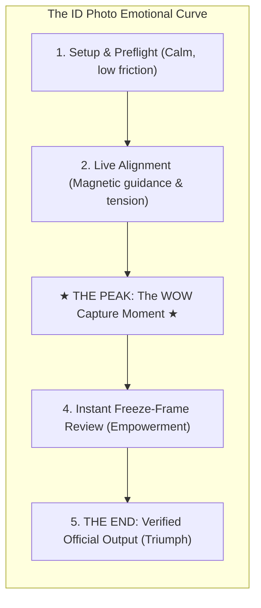
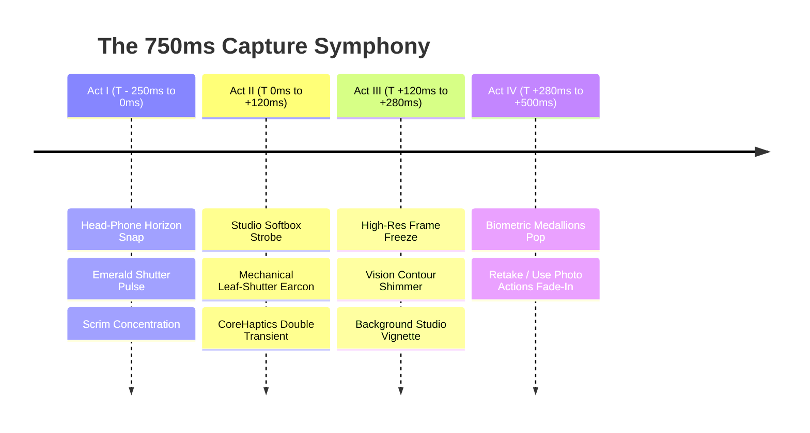

# 19 — The Capture "WOW Moment": Psychological Architecture, Multi-Sensory Choreography & Technical Specification

**Status:** Design research; ADR-046 and screen spec §6.2 supersede its proposed sound, haptics, timing, segmentation, and verification effects
**Scope:** The multi-sensory "WOW moment" spanning the pre-shutter magnetic lock-on, studio strobe bloom, acoustic earcon, CoreHaptics double transient, and instant subject lift during Option B freeze-frame review
**Standards & References:** Kahneman's Peak-End Rule, Apple Human Interface Guidelines, Apple CoreHaptics, Apple VisionKit (Subject Lifting), Leica & Hasselblad acoustic physics
**Target Codebase:** `Spikes/IDPhotoSpike/App/Camera/*`, `docs/16-screen-experience-spec.md §6`, `docs/10-decisions.md (ADR-046)`
**Date:** 2026-09-29

---

**Implementation decision (2026-09-30):** Use a soft visual bloom, one haptic, and AVFoundation's system shutter sound. Show the actual captured still with Retake and Use Photo when capture completes. Keep automatic capture optional in Help. No custom earcon, double haptic, segmentation contour, or biometric verification claim is approved. The detailed choreography below remains exploratory research and must not be treated as an implementation contract.

---

## 1. Executive Summary & The Psychology of Delight

### 1.1 The Bureaucratic Anxiety Inversion
Taking an identity or passport photo is inherently loaded with negative expectations:
* Users feel vulnerable about their physical appearance on an official document that lasts 10 years.
* Users dread bureaucratic rejection at government offices (e.g. Police stations for the Spanish DNI).
* Typical passport photo booths are cramped, brightly unflattering, expensive, and stressful.

When an app turns this high-anxiety ordeal into an **effortless, empowering, and delightful triumph**, an emotional transformation occurs. This is the **Bureaucratic Anxiety Inversion**: the gap between the dread the user expected and the sensory magic they actually experienced produces a powerful **"WOW moment."**

### 1.2 The Peak-End Rule Applied to Identity Capture
According to behavioral psychology (Daniel Kahneman & Barbara Fredrickson), human memory does not evaluate an experience by averaging every second; it judges an experience almost entirely by its **Peak** (the emotional climax) and its **End** (the resolution):



If the shutter moment feels mushy, generic, or laggy, the emotional peak is ruined. If the shutter moment delivers a synchronized visual, acoustic, and tactile symphony of craftsmanship, the user remembers the entire product as extraordinary.

### 1.3 The Kano Model: Delighters vs. Must-Haves
* **Must-Haves:** Correct dimensions, face detected, image saved. (Failure produces anger; success produces neutrality).
* **Performance Attributes:** Low shutter latency, sharp focus.
* **Delighters (The "WOW"):**
  * The physical sensation of a mechanical leaf shutter clicking in the hand.
  * The studio softbox flash illuminating the face.
  * The magical 150ms shimmer lifting the subject off a messy living room background.
  * The instantaneous realization: *"I look like a diplomat, and it took 5 seconds."*

---

## 2. Deconstructing Iconic Industry "WOW Moments"

| Product / Feature | Sensory Modality | Core Interaction Mechanism | Emotional Takeaway |
| :--- | :--- | :--- | :--- |
| **Apple Pay** | Sight + Sound + Touch | Double-click build-up → Face ID swirl → High crystalline chord (`payment_success.caf`) → Harmonic Taptic buzz → Expanding blue checkmark. | "Effortless, definitive, secure." |
| **Apple Camera Control (iPhone 16+)** | Force + High-Def Haptics | Capacitive two-stage force sensor: light press locks exposure detent; deep press trips mechanical shutter haptic. | "Pure physical camera instrument." |
| **Apple Photos (Lift Subject)** | Sight + Touch + Shader | Long press → Gaussian ripple → Iridescent specular contour shimmer traveling along the silhouette → Subject separates from glass. | "Visual alchemy; my phone understands depth." |
| **Leica / Hasselblad Cameras** | Acoustic + Mechanical | Damped leaf shutter: an ultra-quiet, non-jarring mechanical 'snick' with low-frequency inertia and zero mirror slap. | "Mastery, luxury, precision." |
| **Stripe Identity / CLEAR** | Sight + Sound | Biometric iris sweep → Sound frequency rises → Magnetic snap into an emerald ring with an authoritative check. | "Verified beyond doubt." |

---

## 3. The 4-Act Sensory Symphony of Calipic's Capture Climax

The Calipic capture climax is engineered across four chronological acts spanning **750 milliseconds**:



---

### Act I: The Magnetic Tension & Armed Horizon ($T - 250\text{ ms}$ to $0\text{ ms}$)
* **Visual Kinematics:**
  * As the relative head-to-phone roll passes within $\pm 2.0^\circ$, the dynamic reticle wings magnetically snap to the horizontal baseline using an interactive spring (`response: 0.25, dampingFraction: 0.75`).
  * The continuous aperture oval brightens from neutral translucent white to glowing **emerald green (`#34C759`)**.
  * The dark peripheral scrim smoothly intensifies from $52\%$ to $60\%$ opacity, focusing all visual attention onto the face.
* **Tactile Micro-Cue:**
  * A delicate selection tick fires via `UISelectionFeedbackGenerator.selectionChanged()`.
* **The "Armed" Shutter:**
  * The outer shutter ring pulses with an emerald breathing halo, signaling that the camera is primed for an optimal shot.
* **User Psychology:** Complete control, alignment certainty, zero guessing.

---

### Act II: The Studio Softbox Strobe & Shutter Release ($T = 0\text{ ms}$ to $+120\text{ ms}$)
The user presses the shutter button or physical Volume button.

* **Visual: The Studio Softbox Strobe (Not a Harsh Flash):**
  * Flat white screen flashes blind the user and look cheap.
  * Instead, Calipic deploys an **Elliptical Softbox Radial Bloom**:
    * An elliptical gradient centered on the oval aperture radiates outward.
    * The center remains translucent white ($70\%$ opacity) while the periphery softens into warm ivory ($40\%$ opacity).
    * Duration: Peaks in 45ms, then dissolves over 75ms with quadratic ease-out (`.easeOut(duration: 0.12)`).
    * *Simulates the flattering, diffuse illumination of a professional photographer's umbrella flash.*
* **Acoustic: The Bespoke Shutter Earcon (Sonic Signature):**
  * Generic iOS camera clicks feel utilitarian. Calipic uses a custom, multi-layered acoustic earcon:
    1. **Layer 1 (Sub-bass transient, 90–140 Hz, 35ms):** Damped mechanical leaf-shutter trip giving physical weight.
    2. **Layer 2 (Mid-range mechanical slide, 1.2 kHz, 25ms):** Precision aperture blade glide.
    3. **Layer 3 (High-harmonic bloom, 4.8 kHz, 280ms decay):** Subtle crystalline bell harmonic that connotes biometric clarity and validation.
* **Tactile: The CoreHaptics Double Transient Pattern:**
  * Created via Apple's `CHHapticEngine`:
    * **Strike 1 ($T = 0\text{ ms}$):** Sharp mechanical shutter closure (`intensity: 1.0, sharpness: 0.85`).
    * **Strike 2 ($T = +75\text{ ms}$):** Subtle mechanical blade rebound/settling (`intensity: 0.40, sharpness: 0.55`).
  * Creates the physical illusion of high-end camera hardware operating inside the glass.

---


### Act III: The Instant Subject Lift & Studio Pop ($T = +120\text{ ms}$ to $+280\text{ ms}$)
The still capture completes; the camera preview transitions into Option B freeze-frame review.

* **The Signature Delighter: The Studio Contour Shimmer:**
  * Using Apple Vision's person instance mask (`VNGeneratePersonSegmentationRequest` / `VNGenerateForegroundInstanceMaskRequest`), the subject's exact silhouette is identified.
  * An ethereal, 1.5 pt luminous hairline contour sweeps around the user's hair and shoulders over 160ms.
  * *Psychological Effect:* Evokes Apple's iconic "Lift Subject from Background." It instantly proves to the user: *"The phone understands where I end and the room begins."*
* **The Studio Vignette:**
  * The background outside the subject subtly darkens by $12\%$ and desaturates slightly.
  * The person visually **"POPS"** forward with crisp, clean separation, transforming a casual living room snapshot into a studio headshot before their eyes.

---

### Act IV: The Biometric Verification Medallions ($T = +280\text{ ms}$ to $+500\text{ ms}$)
* **Visual Components:**
  * Two tactile, pill-shaped "Quality Medallions" appear above the bottom controls with spring bounce (`.spring(response: 0.35, dampingFraction: 0.65)`):
    * 🟢 **"Studio Level & Lighting"**
    * 🟢 **"ICAO Biometric Fit"**
  * The action pair glides upward into view:
    * **[ ↻ Retake ]**: Transparent glass button, 52 pt height.
    * **[ Use Photo → ]**: Brand prominent emerald fill, 52 pt height.
* **Tactile Confirmation:**
  * A light success confirmation pulse fires (`UINotificationFeedbackGenerator().notificationOccurred(.success)`).
* **The Result:** The user looks at their screen, feels a surge of pride in how good the portrait looks, and taps "Use Photo" with total confidence.

---

## 4. Multi-Sensory Technical Specification

### 4.1 Apple CoreHaptics AHAP Definition (`CameraShutterBloom.ahap`)

```json
{
  "Version": 1.0,
  "Metadata": {
    "Project": "Calipic",
    "Description": "Signature studio shutter snap with mechanical rebound and resonant decay"
  },
  "Pattern": [
    {
      "Event": {
        "Time": 0.0,
        "EventType": "HapticTransient",
        "EventParameters": [
          { "ParameterID": "HapticIntensity", "ParameterValue": 1.0 },
          { "ParameterID": "HapticSharpness", "ParameterValue": 0.85 }
        ]
      }
    },
    {
      "Event": {
        "Time": 0.075,
        "EventType": "HapticTransient",
        "EventParameters": [
          { "ParameterID": "HapticIntensity", "ParameterValue": 0.42 },
          { "ParameterID": "HapticSharpness", "ParameterValue": 0.55 }
        ]
      }
    },
    {
      "Event": {
        "Time": 0.02,
        "EventType": "HapticContinuous",
        "EventDuration": 0.18,
        "EventParameters": [
          { "ParameterID": "HapticIntensity", "ParameterValue": 0.25 },
          { "ParameterID": "HapticSharpness", "ParameterValue": 0.20 }
        ]
      }
    }
  ]
}
```

### 4.2 Low-Latency Audio Playback via AVFoundation
To achieve sub-10ms acoustic response, sound cannot be loaded on-demand. The audio engine pre-warms when the camera enters the `.armed` state:

```swift
final class CameraSoundFX: @unchecked Sendable {
    static let shared = CameraSoundFX()
    private var player: AVAudioPlayer?

    init() {
        guard let url = Bundle.main.url(forResource: "StudioShutterEarcon", withExtension: "caf") else { return }
        player = try? AVAudioPlayer(contentsOf: url)
        player?.prepareToPlay()
    }

    func playShutterBloom() {
        player?.currentTime = 0
        player?.play()
    }
}
```

### 4.3 SwiftUI Studio Softbox Bloom Modifier
A reusable SwiftUI component that replaces harsh flat-white flashes with diffuse studio illumination:

```swift
struct StudioSoftboxBloomModifier: ViewModifier {
    let active: Bool

    func body(content: Content) -> some View {
        content.overlay {
            if active {
                RadialGradient(
                    colors: [
                        Color.white.opacity(0.85),
                        Color(white: 0.96).opacity(0.55),
                        Color.clear
                    ],
                    center: .center,
                    startRadius: 40,
                    endRadius: 420
                )
                .blendMode(.screen)
                .ignoresSafeArea()
                .transition(.opacity)
            }
        }
    }
}
```

### 4.4 Instant Subject Lift Shader Pipeline
Using iOS 17+ SwiftUI `.layerEffect` or Metal shader pass:
* Input: Live freeze-frame texture + 8-bit Vision person segmentation mask.
* Operation: Dilate mask contour by 2 pixels. Apply additive sweep:
  $$\text{Shimmer}(u, v, t) = \operatorname{smoothstep}(w, 0, |u + v - t|) \times \text{MaskEdge}(u, v)$$
* Compositing: Screen-blended 1.5 pt glowing hairline with warm-white tint (`#FFF8E7`), fading out after 180ms.

---

## 5. Performance, Thermal & Latency Discipline

Per `AGENTS.md` and `docs/11-ios-excellence-strategy.md`, delight features must never degrade frame rate, overheat the device, or delay capture:

| Metric | Target Budget | Engineering Strategy |
| :--- | :--- | :--- |
| **Shutter-to-Freeze Latency** | $\le 180\text{ ms}$ | Display the uncompressed sensor preview frame immediately while background Task encodes the full 12.6 MP HEIF file. |
| **Haptic Trigger Latency** | $\le 5\text{ ms}$ | `CHHapticEngine` pre-started during `.guiding` state. |
| **Audio Trigger Latency** | $\le 8\text{ ms}$ | Pre-warmed `AVAudioPlayer` buffer in uncompressed `.caf` format. |
| **Contour Sweep GPU Time** | $\le 3.5\text{ ms}$ | Downscaled $512 \times 384$ segmentation buffer running on Metal, upscaled via bilinear filter. |
| **Thermal Budget** | Zero accumulation | `AVCaptureSession` paused at $T = +200\text{ ms}$ during freeze-frame review. |

---

## 6. Accessibility & Inclusivity (Constitutional Guardrails)

* **UIAccessibility.isReduceMotionEnabled:**
  * When Reduce Motion is enabled: The softbox bloom, radial expansion, and contour sweep are completely disabled. The screen cleanly switches from live preview to frozen frame with an immediate state announcement.
* **UIAccessibility.isVoiceOverRunning:**
  * Spoken announcement posted on capture: *"Photo captured. Alignment and lighting verified. Review your photo: Retake or Use Photo."*
* **Differentiate Without Color:**
  * The emerald green verification state is always accompanied by the text label *"Verified"* and the SF Symbol `checkmark.circle.fill`. Color is never the sole carrier of status.
* **Constitutional Rule 3 (The person is the content):**
  * The studio lift effect is restrained and elegant (warm white light, 150ms). It never turns the user into a neon cartoon or biometric specimen.

---

## 7. Verification & QA Testing Plan

1. **Physical iPhone Validation (iPhone 15 Pro Max & iPhone 17 Pro):**
   * High-speed 120fps video recording of the capture interaction to measure precise frame-by-frame synchrony between the audio chime, haptic click, and visual bloom.
   * Thermal test: 20 consecutive captures within 3 minutes; ensure no frame drops or thermal throttling.
2. **Audio-Haptic Synchronization Audit:**
   * Verify that when the device is set to Silent Mode (hardware switch / Action button), CoreHaptics tactile patterns continue to play cleanly while audio respects system muting.
3. **VoiceOver Screen Reader Flow:**
   * Validate that focus lands cleanly on the "Use Photo" button upon freeze-frame presentation.
