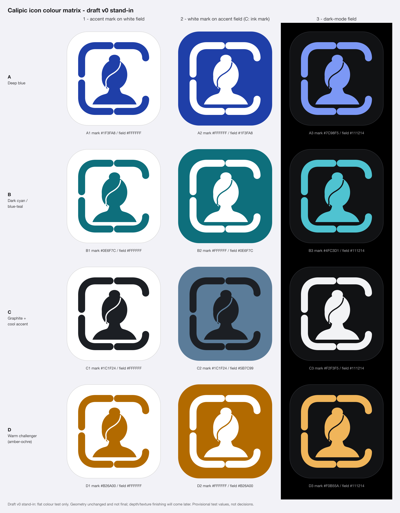
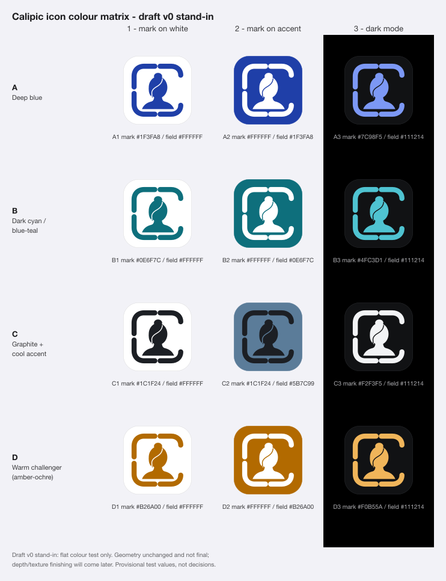
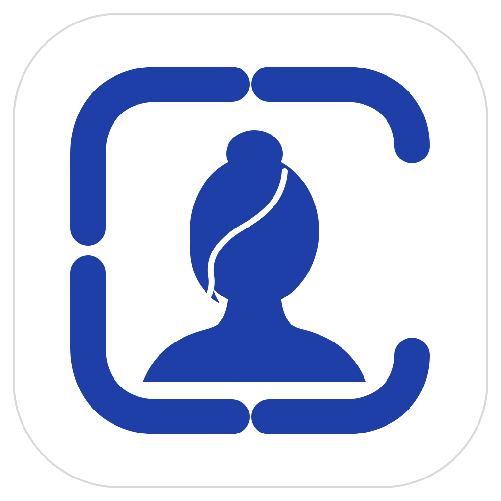
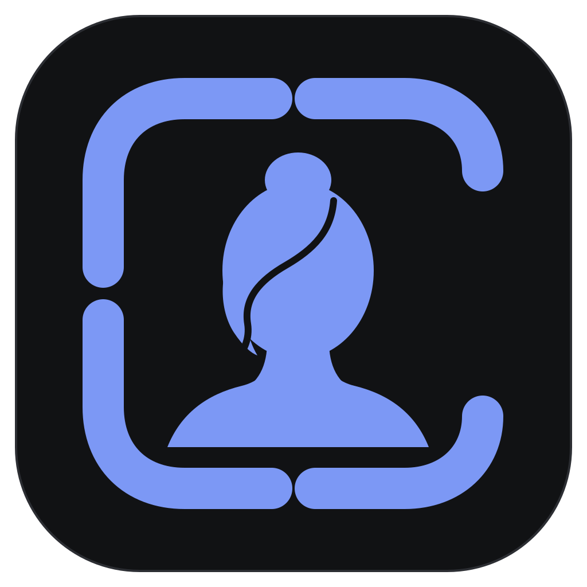
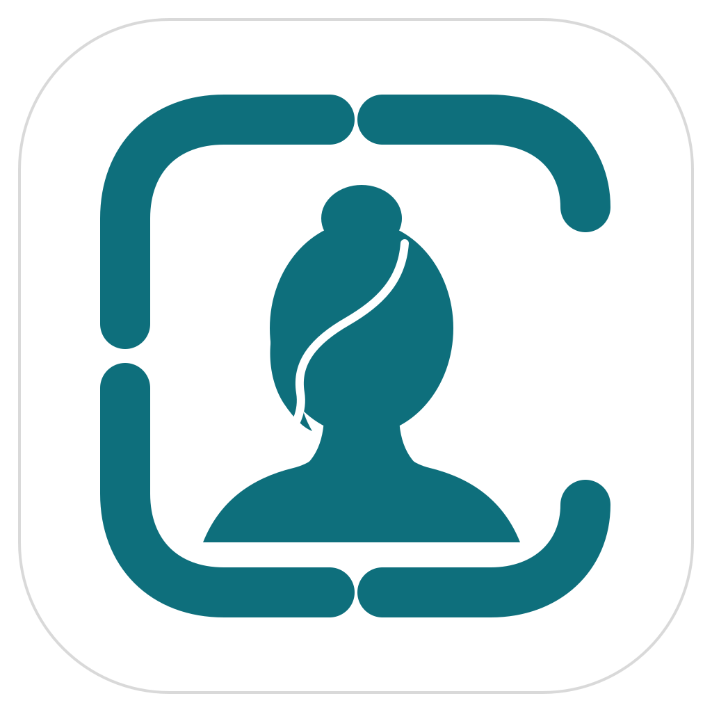
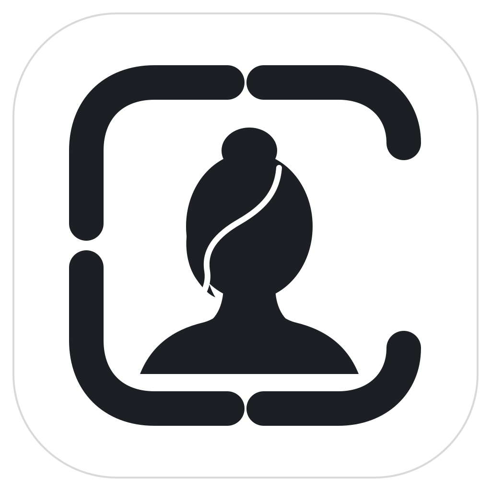
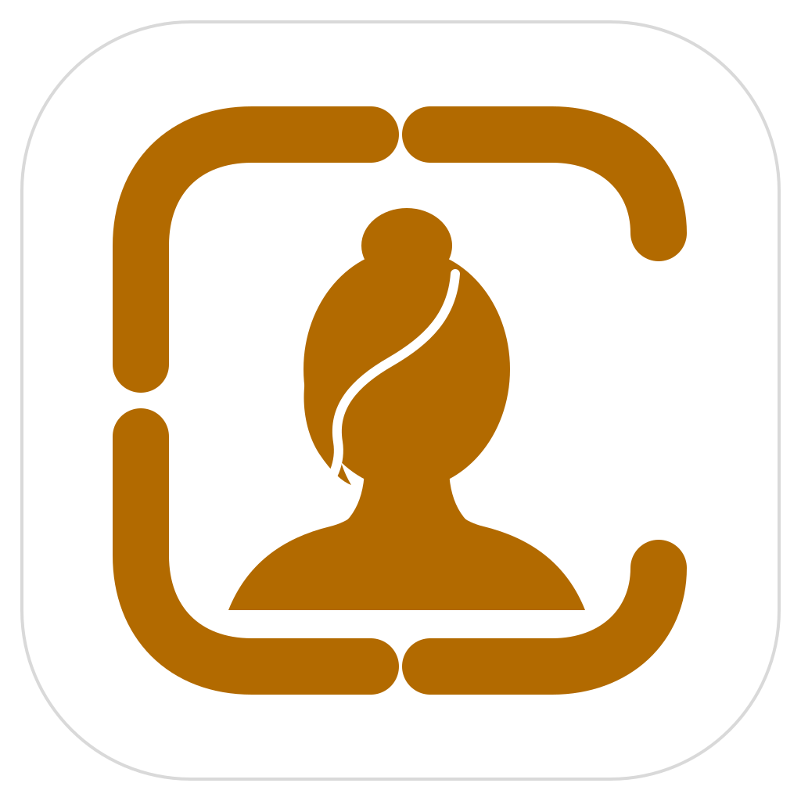
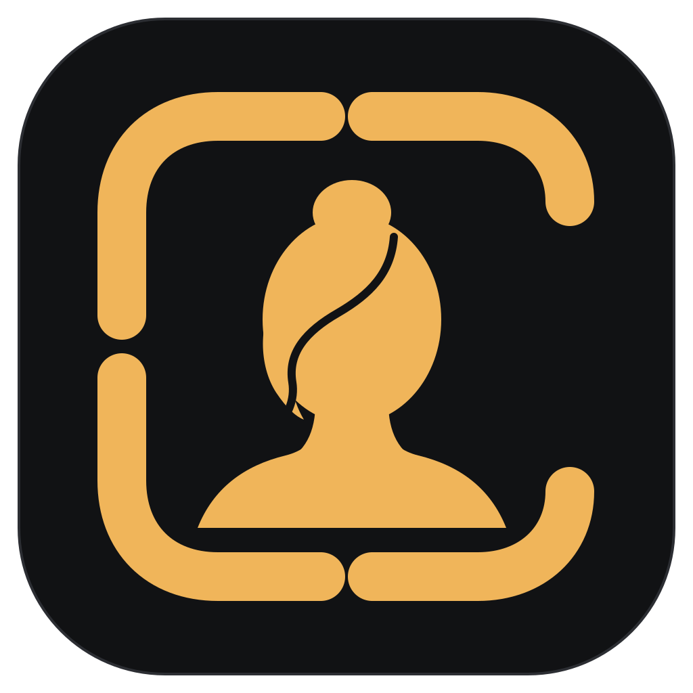

# Calipic — Colour matrix renders (draft v0 stand-in)

**Status:** Evidence / observations — no colour is approved (BD-033 remains the founder's decision)  
**Date:** 2026-09-17  
**Purpose:** Step 1 of `docs/brand/06-identity-exploration-handoff.md` §7: the same icon, geometry fixed, rendered in each candidate colour system so colour can be judged on the full mark rather than on a swatch.

---

## 1. Read this first: the icon is a stand-in

Every render here uses `docs/brand/assets/calipic-icon-draft-v0.svg`, which is **only a draft**. Its form will be substantially refined later, and the final icon will receive finishing (shadows, depth, texture).

Consequences for this document:

- v0 is treated as a **flat stand-in**. Its geometry was not altered in any way.
- The observations evaluate **colour**, not drawing quality. Drawing issues visible in the renders (for example the small tick where the hair strand meets the side-hair mass near the jaw) belong to v0 and are out of scope.
- Both contact sheets and every variant SVG (as a leading comment) are labelled "draft v0 stand-in". The 12 single PNGs are clean icon rasters with no visible label, so **do not circulate them without this document or a contact sheet**; out of context they could be mistaken for an icon proposal.
- §7 lists which conclusions are likely to survive a refined, finished icon and which could change.
- The script takes the input SVG as a parameter, so the entire matrix can be regenerated on a refined icon with one command.

---

## 2. Method

Script: `scripts/brand/render-color-matrix.sh` (bash + `python3` stdlib + `inkscape`). Run from the repo root:

```
scripts/brand/render-color-matrix.sh                        # draft v0 (default)
scripts/brand/render-color-matrix.sh path/to/refined.svg    # re-run on another icon
scripts/brand/render-color-matrix.sh path/to/refined.svg path/to/out-dir
CALIPIC_ICON_LABEL="refined v1" scripts/brand/render-color-matrix.sh path/to/refined.svg
```

What it does:

1. Reads the input SVG and substitutes **only three colour tokens**, in a single pass:
   - `#111111` — the mark (frame + silhouette);
   - `#FFFFFF` — the field **and** the hair-strand cutout, which therefore always matches the field;
   - `#D9D9D9` — the field hairline: kept on the white field, set to the field colour on accent fields (effectively removed), set to `#2C2E33` on the dark field so its edge survives on a black page.
2. Writes one SVG per candidate × treatment (12), each carrying a comment with its cell id, colours and the stand-in label.
3. Exports each at 1024 × 1024 px with Inkscape.
4. Builds two contact sheets as SVG with the 12 variants inlined (no raster scaling) and exports them: a large one (512 px icons) and one exported at 1x with **true 120 px icons** (Home Screen @2x class size).
5. Writes `color-matrix/contrast.tsv` with the WCAG contrast ratio of mark vs field for every cell.

The script is idempotent (it removes its own previous outputs, by exact file name, first) and fails if the input lacks the `#111111` / `#FFFFFF` tokens, so a refined icon must keep those tokens, spelled exactly that way, or be given them before re-running. Any other paint in the input (shadow greys, gradient stops) is left unchanged in every variant and listed in a warning. Inside the contact sheets each inlined copy gets its own id namespace, so gradients, clips and filters of a finished icon resolve per cell.

Not covered here (other units / later steps): placement among real iOS icons, Spotlight/Settings sizes, Increase Contrast, grayscale, colour-vision-deficiency simulation, product screens.

---

## 3. Palette under test

Provisional test values, **not decisions**. The Increase-Contrast values are listed for completeness; they are not rendered in this unit.

| Id | System | Accent light | Accent dark | Increase-Contrast light | IC dark |
|---|---|---|---|---|---|
| A | Deep blue | `#1F3FA8` | `#7C98F5` | `#142C7A` | `#A9BCFF` |
| B | Dark cyan / blue-teal | `#0E6F7C` | `#4FC3D1` | `#084C55` | `#8ADFE9` |
| C | Graphite + cool accent | ink `#1C1F24`, accent `#5B7C99` | ink `#F2F3F5`, accent `#9DB7CF` | `#3D5A73` | `#C3D6E6` |
| D | Warm challenger (deep amber-ochre, icon-only challenger) | `#B26A00` | `#F0B55A` | `#7A4800` | `#FFD08A` |

**The letters in this document are not the letters of `03-color-strategy-research.md` §8.** Mapping:

| This document | 03 §8 |
|---|---|
| A — Deep blue | Candidate A — Distinctive deep blue |
| B — Dark cyan / blue-teal | Candidate **D** — Dark cyan / blue-teal |
| C — Graphite + cool accent | Candidate C — Graphite + small cool accent |
| D — Warm challenger | not lettered; the yellow/orange "challenger icon concept" §8 allows "if the first set lacks warmth or shelf recognition" |
| (not rendered) | Candidate **B** — Restrained violet |

Restrained violet was left out of this test round by the brief for this work package (no violet/purple, consistent with 06 §7 "avoid contemporary purple/gradient AI branding" and with the AI-association failure mode 03 §8 itself names). That exclusion is a scoping choice of this round, not a recorded brand decision; if the founder wants violet evaluated, it is one extra row in the script's `CANDIDATES` table. To avoid ambiguity, the ranking in §6 always names the hue next to the letter.

Treatments:

| # | Treatment | Mark | Field |
|---|---|---|---|
| 1 | Accent mark on white field | accent light (C: ink) | `#FFFFFF` |
| 2 | White mark on accent field | `#FFFFFF` (C: ink `#1C1F24`) | accent light (C: accent `#5B7C99`) |
| 3 | Dark-mode field | accent dark (C: ink dark `#F2F3F5`) | `#111214` |

For C the mark is always ink; its accent appears only as the treatment-2 field. C's dark accent `#9DB7CF` is therefore not exercised by these three treatments.

Measured mark-vs-field contrast (from `contrast.tsv`):

| Candidate | 1 on white | 2 on accent | 3 dark mode |
|---|---|---|---|
| A Deep blue | 8.99 | 8.99 | 6.84 |
| B Dark cyan | 5.86 | 5.86 | 8.98 |
| C Graphite | 16.52 | 3.77 | 16.88 |
| D Warm ochre | 4.24 | 4.24 | 10.23 |

---

## 4. Renders

All images: **draft v0 stand-in**, flat colour test only.

### Contact sheet — large



### Contact sheet — true 120 px icons



### Single renders (1024 px)

| | 1 — mark on white | 2 — mark on accent field | 3 — dark mode |
|---|---|---|---|
| **A** Deep blue |  |  |  |
| **B** Dark cyan |  |  |  |
| **C** Graphite |  |  |  |
| **D** Warm ochre |  |  |  |

Editable SVG sources sit next to each PNG with the same base name.

---

## 5. Observations against the 03 §9 criteria

These are one reviewer's observations from the renders above, at 1024 px and at 120 px. They are inputs to the founder's decision, not a verdict. "Accessibility" from §9 is only touched through the contrast figures; the full accessibility pass is a later step.

### 5.1 Immediate ID-photo recognition

- The portrait-in-frame reading holds in all 12 cells; colour does not break it anywhere.
- It is strongest where mark/field contrast is highest: C1, C3, A1, A2. It is weakest in **C2** (3.77:1, ink on mid blue-grey), where the bust merges towards the field and the hair strand nearly disappears at 120 px.
- D1/D2 (4.24:1) are legible but visibly softer than A and B at 120 px; the frame gaps and the C opening remain clear, the hair strand is the first detail to fade.
- The C opening reads equally in every colour; it is a geometry property, not a colour one.

### 5.2 Elegance

- A2 and B2 (white mark on a deep saturated field) read as the most finished icons in flat form.
- C1/C3 are elegant in a typographic, monochrome way, but depend entirely on the drawing quality of the mark, which is exactly the part that is still a draft.
- D2 is handsome but heavier; the ochre field reads as "material" (leather, kraft, wood) more than as "photographic".

### 5.3 Friendliness

- D is the warmest and most approachable, clearly. B is the friendliest of the cool candidates: the teal feels cleaner and lighter than the blue.
- A is calm but formal. C is the least friendly; C1 and C3 in particular feel austere.

### 5.4 Sophistication

- C and A2 lead. B2 is close behind. D2 is sophisticated only if the ochre stays deep; its dark-mode value `#F0B55A` (D3) drifts towards a sandy yellow that loses the restraint.
- A3 (`#7C98F5`) is the least sophisticated cell in the A row: the periwinkle is the closest any cell comes to the violet family that the rules exclude. Hue-wise it is still blue, but it is worth pulling slightly towards cyan or lowering saturation if A proceeds.

### 5.5 Photographic neutrality

- By construction C is the most neutral: ink and a blue-grey do not compete with skin tones at all.
- A and B are cool hues, complementary to most skin tones, so small accents next to a portrait should separate cleanly. B's teal sits closer to a direct complement of warm skin and may make skin look slightly redder by simultaneous contrast when used in large areas; as a small accent (the §7 rule in 03) this is unlikely to matter. To be verified in the product-screen unit.
- D is the problem case: amber-ochre is **in the skin-tone family**. In product UI it would compete with, and visually tint the perception of, the portrait. This supports the constraint already written into the palette: D is an icon-only challenger, not a UI accent.

### 5.6 Category differentiation

- A is the most generic: blue portrait-utility icons are the category default (03 §8 names this failure mode). A2 in particular could be a contacts, ID, or banking app.
- B is differentiated from system blue and from the blue cluster while staying in a trustworthy register.
- D is by far the most differentiated on a shelf of blue/white utilities.
- C1/C3 differentiate through absence of colour; on a Home Screen this can read either as premium or as "unbranded/system". This cannot be settled without the real-context placement test.

### 5.7 Consistency with native iOS

- All four are plausible iOS icons. A is the most native-feeling, which is also its genericness risk. C3 resembles the system's own dark/tinted icon renderings, which is a fit, but means the dark icon carries no brand colour at all.
- As an in-app accent: A is near enough to system blue to feel familiar yet must stay clearly distinguishable from link/action blue (03 §6 rates this conflict moderate-high). B has the cleanest separation from all four status families. D conflicts directly with the warn family (yellow/orange), which again confines it to the icon.

### 5.8 Accidental "AI-powered" look

- None of the cells uses gradients, glow or sparkle, and no violet is present, so no cell reads as AI-branded in flat form.
- Relative risk: A3's periwinkle is nearest to that territory; B3's bright cyan on near-black (`#4FC3D1` on `#111214`) has a mild "tech/SaaS dashboard" feel, the failure mode 03 §8 predicted for teal. Both are dark-mode values and both are tunable (slightly lower saturation/lightness) without changing the light-mode identity.
- This risk will rise, not fall, when depth and finishing are added: glossy or luminous finishing on A3/B3-style colours would push them towards the AI look. Matte/paper-like finishing would not.

### 5.9 Cheap or childish risk

- No cell is childish; the restrained single-hue treatment prevents that.
- "Cheap" risk is highest for D1 (ochre line-art on white reads a little like a generic template/clip-art tint and has the lowest contrast) and for C2 (muddy, low contrast). A1/B1 are clean but plain: accent-on-white makes the icon look like a document glyph rather than an app.
- Treatment 2 is consistently the least cheap-looking treatment for A, B and D.

### 5.10 Treatment-level observation (independent of hue)

- **Treatment 2 (light mark on accent field) is the strongest light-mode app-icon treatment for A, B and D**: more shelf presence, better small-size survival of the frame, and the hair-strand cutout stays visible because it takes the saturated field colour.
- **Treatment 1** is the natural form for in-app brand moments, documents and print, where a full colour field would be too heavy.
- **For C, treatment 2 as specified does not work** (3.77:1). If C proceeds, its accent field needs either a lighter mark (white on `#5B7C99` is about 4.4:1, still weak) or a darker accent field (the IC value `#3D5A73` with a white mark would be around 7:1). This is an observation about the test values, not a geometry issue.

---

## 6. Provisional ranking

Colour only, flat draft v0 stand-in, icon-level evidence only. Not a decision.

1. **B — Dark cyan / blue-teal** (03 §8 "Candidate D"). Best balance across the criteria: differentiated from system blue and from the category's blue cluster, friendly yet composed, no status-colour conflict, solid contrast in all three treatments. Open issue: tame B3's dark-mode cyan to reduce the tech/SaaS note.
2. **A — Deep blue.** The safest and most elegant in A2, highest light-mode contrast of the chromatic candidates (8.99) but the lowest of them in dark mode (A3 6.84), most native. Held back by genericness and by the dark-mode periwinkle. If A proceeds it needs a differentiation argument that colour alone does not give it.
3. **C — Graphite + cool accent.** Best photographic neutrality and sophistication, and the best in-product system on paper, but the weakest as an app icon: C1/C3 carry no colour recognition and C2 fails on contrast as specified. A hybrid is worth testing later: C's neutral product surfaces with B (or A) as the single accent and icon field. That matches 03 §10 ("neutral photographic surfaces + one restrained, highly ownable accent").
4. **D — Warm challenger.** Most distinctive and friendliest, and worth keeping in the real-context shelf test for exactly that reason, but lowest light-mode contrast, in the skin-tone family, in conflict with the warn status family, and with some cheapness risk in D1. Viable only as an icon-only colour, which would split icon and in-app accent.

Recommendation: carry **dark cyan / blue-teal (B here) and deep blue (A)** forward as the primary finalists into real-size/real-context, Light/Dark/Increase-Contrast and product-screen testing, keep **C's neutral surface logic** as the product baseline for whichever accent wins, and keep **D2** in the Home Screen/App Store placement test purely as a differentiation benchmark.

---

## 7. Caveats, and what could change once the icon is refined and finished

Likely to **survive** refinement and finishing (properties of the colours themselves):

- contrast figures and the C2 contrast failure;
- D's skin-tone-family and warn-status conflicts;
- A's proximity to the generic blue utility cluster;
- B's separation from system blue and from all status families;
- the no-violet proximity note on A3.

Likely to **change** and therefore to be re-tested with the script on the refined icon:

- **Elegance, sophistication and cheap-risk scores.** These are the most finish-dependent. Depth, shadow and texture can make a plain flat treatment (A1/B1/C1) feel premium, or a good flat one feel overworked. C in particular could move up: a monochrome mark with real material finishing is a classic premium icon recipe, and its flat form undersells it.
- **Treatment ranking.** Treatment 2's advantage comes from the large flat colour field. With depth on the field (lighting, subtle vignette), perceived hue and saturation shift; a finished white field with a dimensional coloured mark might close the gap.
- **Dark-mode values.** A3/B3/D3 brightness was judged on a flat near-black field. With shadows and inner depth, lighter accents may need to come down to avoid a glowing/AI look (see §5.8).
- **Hair-strand visibility.** It is a 12-unit stroke in v0; its survival at small sizes depends on refined geometry as much as on colour. Only the relative ordering between colours (weakest in C2, D1) is expected to hold.
- **Skin-tone reading of the silhouette.** In D, and only in D, the flat bust fill takes on a literal "skin/tan figure" reading, which is undesirable for neutrality. A refined silhouette or finishing could strengthen or weaken that.

General limitations:

- single reviewer, on-screen sRGB renders; no Display P3, no physical device, no ambient-light check;
- icons judged on a plain `#F2F2F7` / black page, not among real iOS icons or on wallpapers;
- no Increase Contrast, grayscale or colour-vision-deficiency renders in this unit;
- hex values are provisional test values and each candidate could be tuned; a ranking between tuned values might differ at the margin;
- form and colour are to be selected together (03 §9), so this ranking must be re-run once the form changes — hence the parameterised script.
