# Calipic — Product-context colour test

**Status:** Evidence / provisional findings. No colour is approved; BD-033 remains the founder's decision.  
**Date:** 2026-09-17  
**Inputs:** `06-identity-exploration-handoff.md` Step 4, `03-color-strategy-research.md` §5–9, the shared provisional test palette below.  
**Question:** *How little explicit branding is required for the product to still feel recognizably Calipic?*

---

## 1. What was tested

The running app, unchanged except for one root-level `.tint(...)`, captured on an iPhone 17 Pro simulator (iOS 26.5) for the untinted baseline and four provisional accent candidates, in Light, Dark, Light + Increase Contrast and Dark + Increase Contrast.

| Id | System | Light | Dark | Increase Contrast light | Increase Contrast dark |
|---|---|---|---|---|---|
| baseline | system default (iOS blue) | — | — | — | — |
| A | Deep blue | `#1F3FA8` | `#7C98F5` | `#142C7A` | `#A9BCFF` |
| B | Dark cyan / blue-teal | `#0E6F7C` | `#4FC3D1` | `#084C55` | `#8ADFE9` |
| C | Graphite + cool accent | `#5B7C99` | `#9DB7CF` | `#3D5A73` | `#C3D6E6` |
| D | Warm challenger (amber-ochre) | `#B26A00` | `#F0B55A` | `#7A4800` | `#FFD08A` |

These are **test values, not decisions**. Nothing else was redesigned: no layout, copy, symbol, material or status-colour change.

### Method

- `App/Brand/BrandCandidate.swift` reads the launch argument `-brandCandidate A|B|C|D` (Debug builds only, launch-argument domain only, never persisted). Without it the app keeps the system tint, so the shipped look is unchanged. The colours live in `App/Resources/Assets.xcassets` (`BrandAccentA…D`, any/dark × normal/high contrast, sRGB).
- The tint is applied once, at the root scene in `IDPhotoSpikeApp.swift`. Status colours (green / orange / red / secondary) are hard-coded semantic colours and do not read the tint.
- `UITests/BrandContextUITests.swift` drives the normal flow with the generated fixture photo and attaches nine screenshots per run (they are skipped in the normal test suite; `Tests/BrandCandidateTests.swift` covers the switch there): Home, Camera intro, Camera unavailable, Photo Check, Adjust, Adjust details, Sheet, Share, Home with a session.
- `scripts/brand/export-brand-screenshots.sh "<destination>"` sets the simulator appearance with `simctl`, runs the capture tests once per appearance and exports everything to `Artifacts/brand-review/` (`brand-<candidate>-<appearance>-<Screen>.png` + `manifest.json`). `BRAND_REVIEW_INCREASE_CONTRAST=1` adds the two Increase Contrast passes. That folder is gitignored and regenerable (180 screenshots for the full matrix); the representative, downscaled screenshots embedded below are committed in `product-context/`.

### Limits of this evidence — read before drawing conclusions

1. **The fixture is a four-colour test card, not a face.** The simulator has no camera and the repository holds no portrait fixtures, so this run shows *where* and *how much* accent sits next to the photo, but it cannot show an accent against real skin tones. The skin-tone remarks in §4 are reasoned from hue relationships and must be confirmed on a device with real portraits of varied skin tones (research §9, item 6).
2. **The live guided camera is not reachable on a simulator.** Only the camera instructions and the "camera unavailable" screen were captured.
3. Simulator rendering only: no physical-device, ambient-light, Display P3, grayscale or colour-vision-deficiency check here (handoff Step 3).
4. The placeholder app icon added with the asset catalog is the **v0 draft geometry, untouched**, on a neutral white field with a `#111111` mark. It is wired into Debug builds only, so the simulator and development installs have an icon while Release builds are unaffected; it is not an icon proposal and not a colour pick. The draft's form and finishing (depth, shadow, texture) are still to be substantially refined.

---

## 2. Where the tint actually shows up

This is the main finding: with native controls, one root tint reaches very few places, and all of them are *controls*. No surface, background, navigation bar, title, body text or photo frame takes the accent.

| Screen | Elements that take the accent | Elements that do not |
|---|---|---|
| Home | "Take Photo" fill (prominent); "Choose Photo" label, glyph and its pale bordered fill | Title, headline, document card, session card, privacy note, version |
| Camera instructions | "Cancel", "Next"/"Start" fill, the switch when on — always with the **dark** accent value, because the camera forces a dark scheme even in Light Mode | Ring legend (green / orange / grey status colours), text |
| Camera unavailable | One prominent button | Everything else |
| Photo Check | "Add to sheet" fill; "Adjust" and "Retake" labels and pale fills; **the trash (delete) toolbar glyph** | Photo, headline icon (orange/green/red), row icons, all text, back button |
| Adjust (sheet) | "Done", "Reset"/"Compare" labels, switch track, "Details" disclosure label, slider track | Segmented background picker (neutral), status row, photo |
| Sheet | "Continue" fill; "Check", "Add another size", "Add another person" labels and glyphs | Sheet preview, stepper, summary |
| Share | "Print" fill; "Share PDF"/"Share JPEG" labels and pale fills; the small share badge on each photo; "Done" | The green "files are ready" seal, preview, text |

The tint propagates into sheets (Adjust) without extra code. Nothing in the app needed per-view colour work, and nothing broke.

| Baseline | A | B | C | D |
|---|---|---|---|---|
| 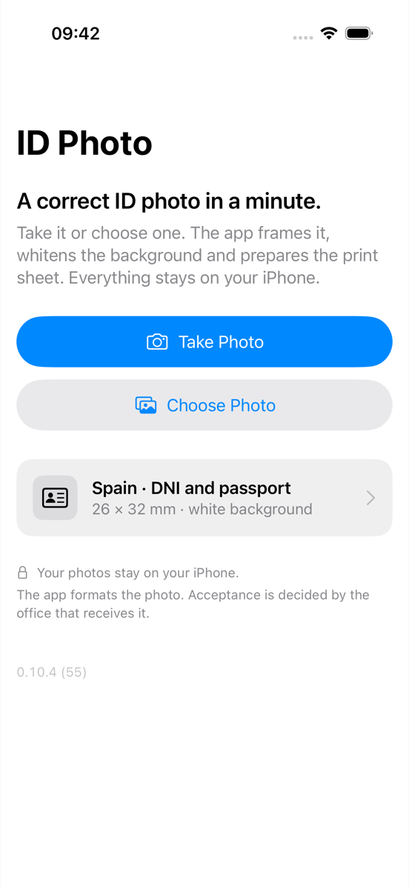 | 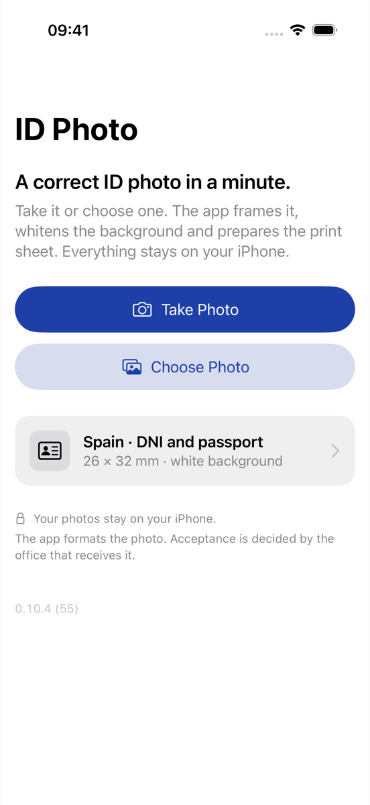 | 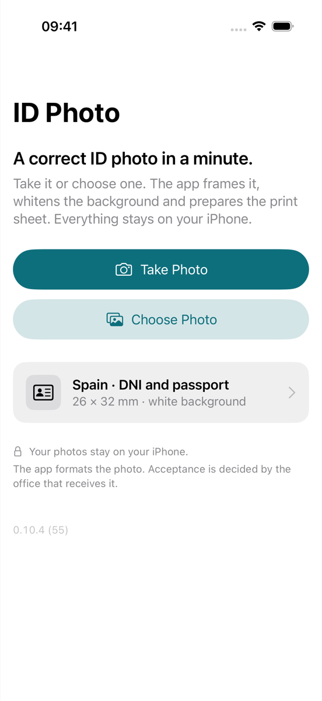 | 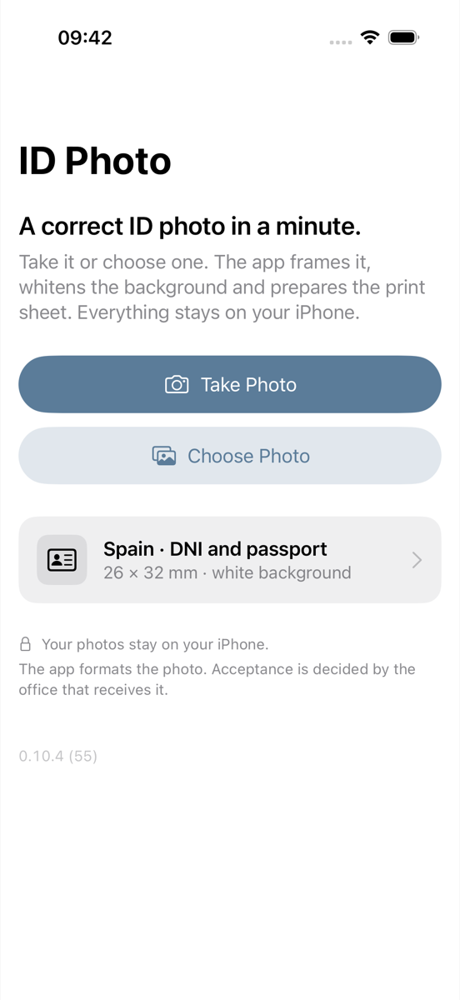 | 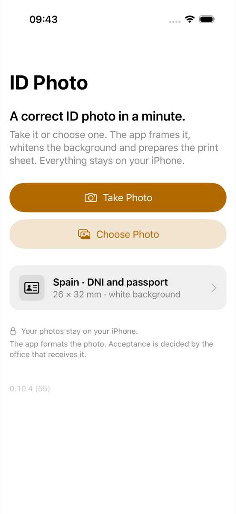 |

Other screens, one candidate each (the pattern is identical for all four):

| Adjust (B) | Sheet (C) | Camera instructions (B, Light Mode) | Home with session (A) |
|---|---|---|---|
| 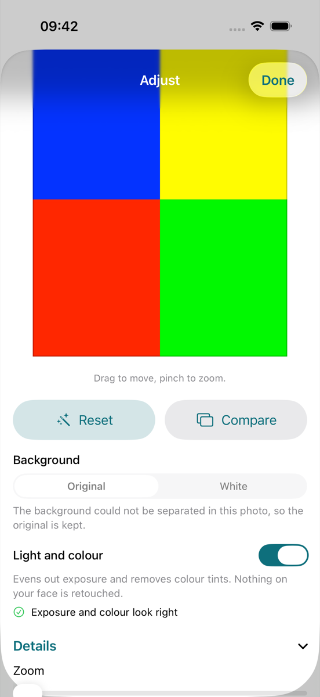 | 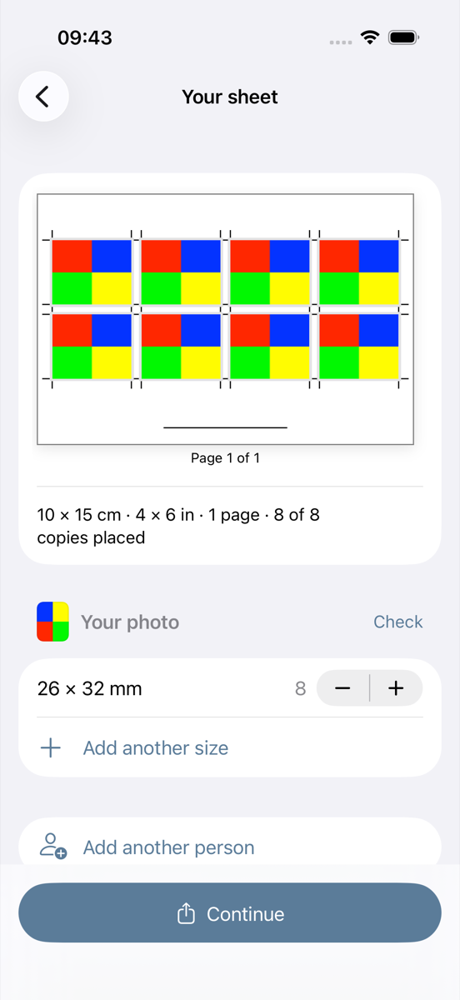 | 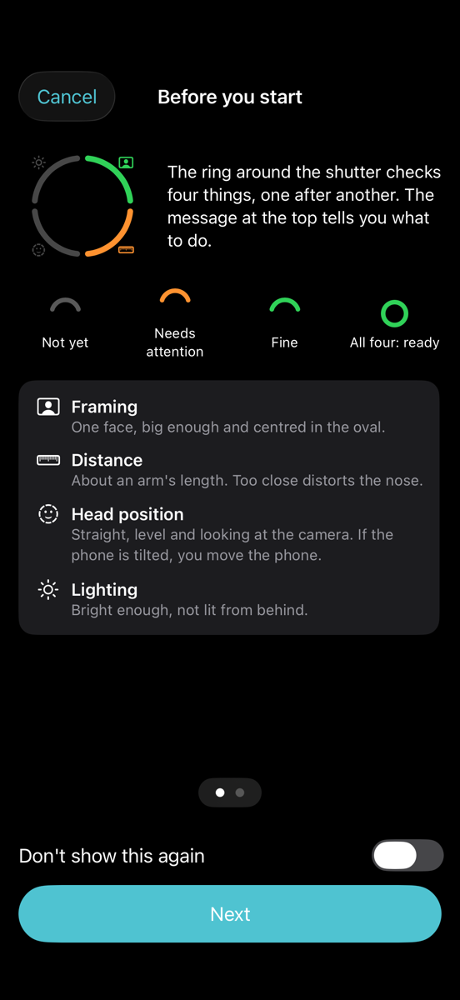 | 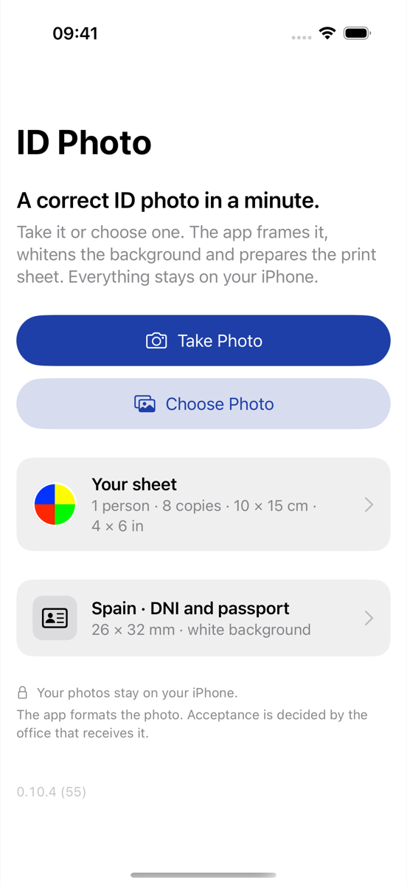 |

---

## 3. Accent versus status colours

Status colours are unchanged in the captures inspected (by eye, baseline against each candidate in Light and Dark): the orange "A few things to check" mark, the green pass ticks, the grey manual-check eyes, the camera ring legend and the green completion seal look the same across baseline and A–D, as expected from code that never reads the tint.

Photo Check, Light:

| Baseline | A | B | C | D |
|---|---|---|---|---|
| 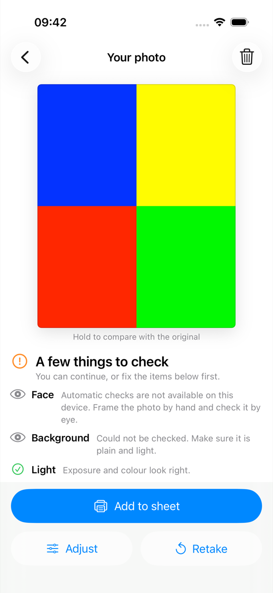 | 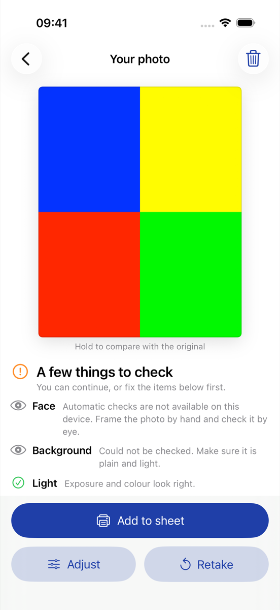 |  | 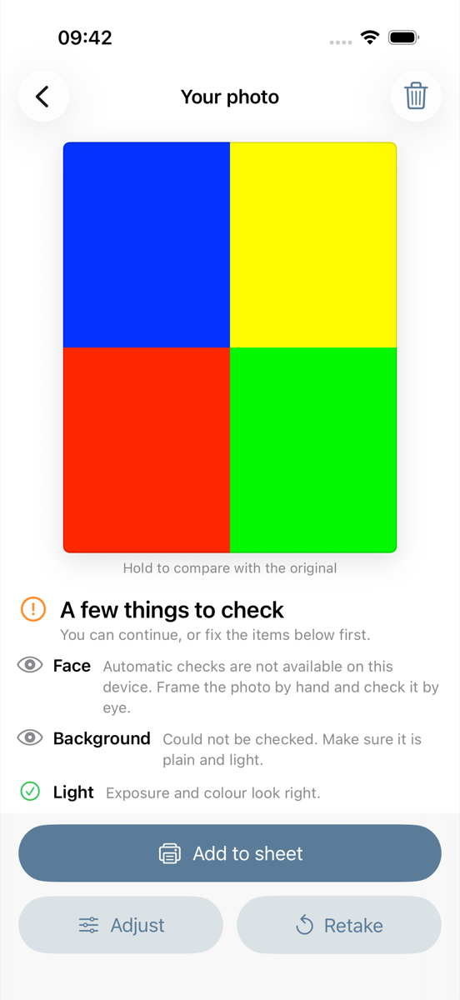 | 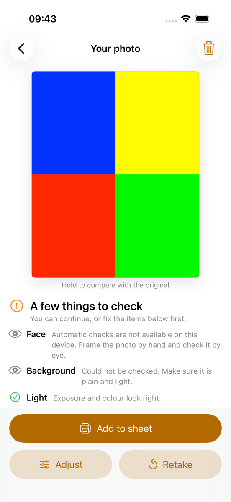 |

Photo Check, Dark:

| Baseline | A | B | C | D |
|---|---|---|---|---|
| 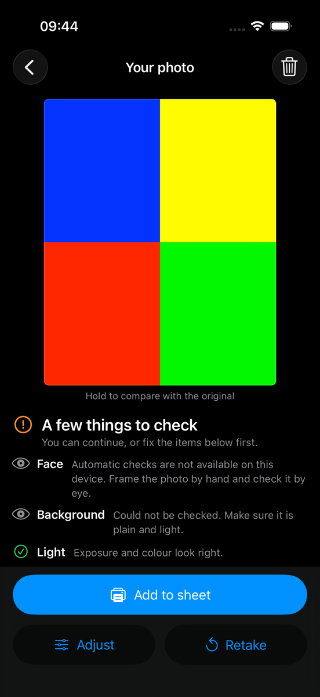 | 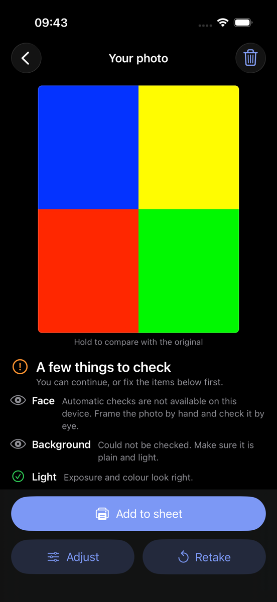 |  | 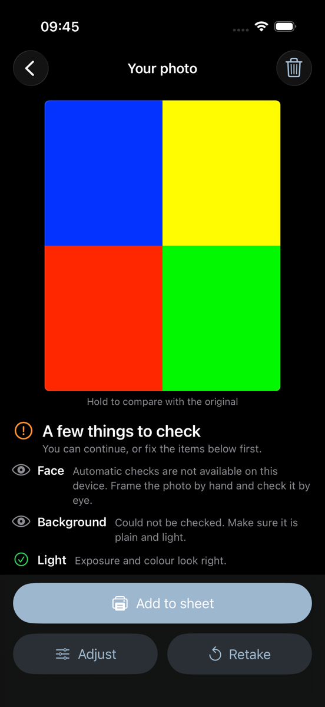 | 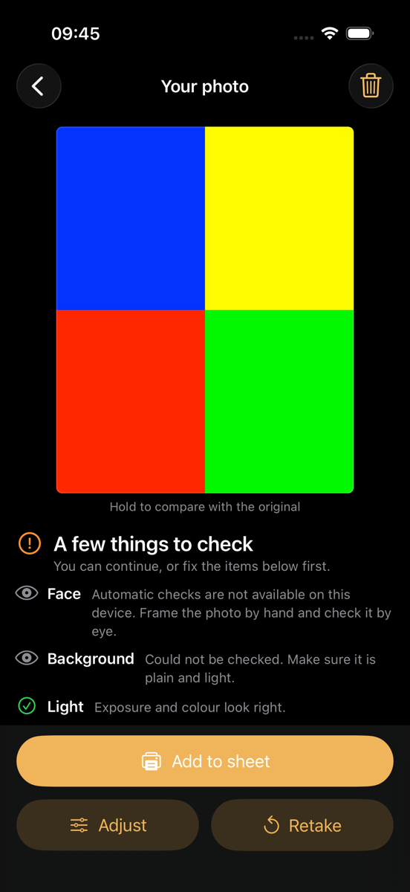 |

Share (completion), Light:

| Baseline | A | B | C | D |
|---|---|---|---|---|
| 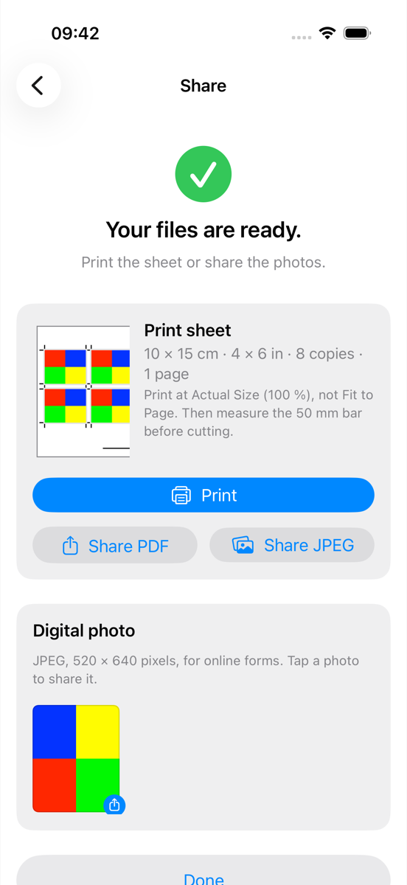 | 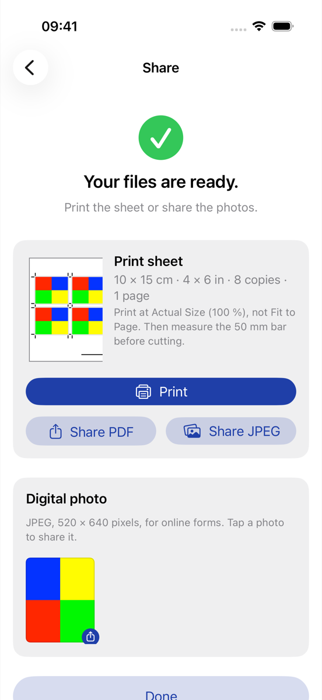 | 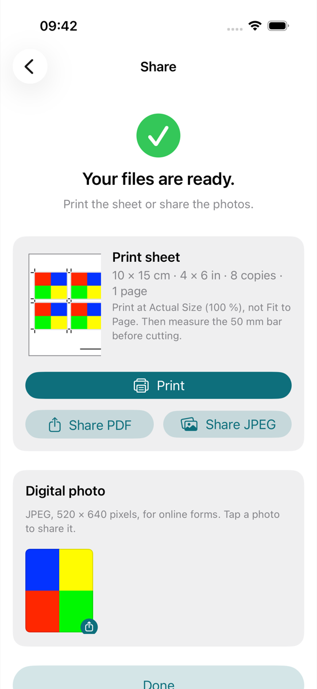 | 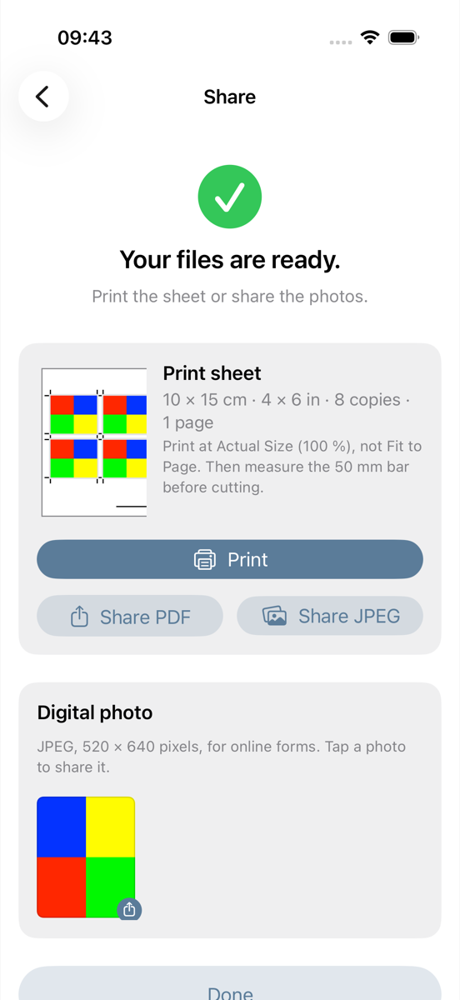 | 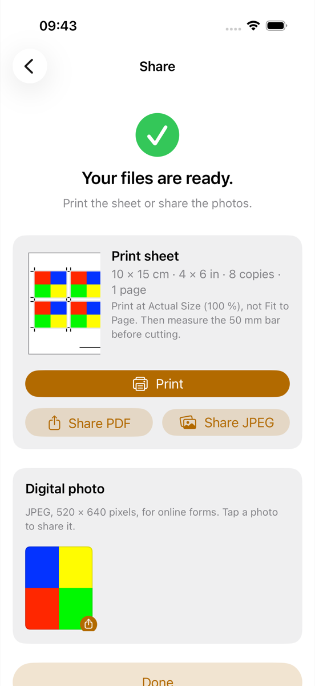 |

Observations:

- **D collides with "warn".** On Photo Check the orange warning mark sits one thumb-width above three amber controls. In Dark Mode the amber accent `#F0B55A` and system orange are almost the same colour (luminance contrast 1.1:1); the primary action reads as part of the warning. This is exactly the conflict predicted in research §6, now confirmed in context. The three amber controls also make the screen feel like it is in a caution state even when every check passes.
- **B sits nearest to "pass" green** but stays separable: teal buttons and the green tick/seal are clearly different hues in both appearances. Worth re-checking under deuteranopia/protanopia simulation before relying on it.
- **A and C never compete with a status colour.** C is so quiet that the status marks become the most saturated things on the screen after the photo — arguably the correct hierarchy for a checking tool.
- **Finding independent of candidate:** the delete (trash) toolbar button takes the brand accent. A destructive action wearing the brand colour is a semantic leak; it should become neutral or role-based when the design system is built. Not changed here (no UI redesign in this step).

---

## 4. Per-candidate observations

Judged in context, against photo primacy and the character list in handoff §9. Skin-tone remarks are hypotheses (see Limits 1).

### Baseline — system blue

Feels like a well-made system utility and nothing else. Entirely native, entirely anonymous: there is no moment at which the screen could be told apart from any other iOS 26 app. Useful as the control: it shows that the layout, copy and photo already carry the experience.

### A — Deep blue

- The smallest perceptual step from baseline that still reads as deliberate; darker and calmer than system blue, and the filled button gains weight and seriousness.
- Best text/fill contrast in Light Mode (white on fill 9.0:1).
- Blue is far from every skin hue, so it is unlikely to cast or compete with faces; it is, however, close to the blue/grey of typical ID-photo backdrops — check for the accent "merging" with a blue background photo.
- Main risk confirmed rather than dispelled: in a screenshot without the icon it could be a bank or a government-forms app. Recognition would rest almost wholly on the symbol.

### B — Dark cyan / blue-teal

- The most *ownable* of the three cool candidates in context: clearly not system blue, clean and photographic next to white paper previews, friendly without being playful.
- In Dark Mode the bright cyan `#4FC3D1` is the most "tech/SaaS" moment of the whole matrix, especially on the always-dark camera instructions. The light value is more Calipic than the dark value; the dark value wants to be deeper and less luminous.
- Teal is roughly complementary to skin hues, which tends to flatter rather than fight them, but large teal areas can make skin read warmer/redder by simultaneous contrast. With the accent confined to buttons below the photo this should be minor — verify with real portraits.

### C — Graphite + cool accent

- The strongest expression of "the photo is primary": the controls recede, the portrait and the status marks lead. Closest to the "almost invisible native-iOS product experience" in the handoff.
- The cost is visible too: the pale bordered buttons look nearly disabled in Light Mode, the prominent fill has the lowest Light-Mode contrast of the set (4.4:1) and the primary action loses pull on Home. It risks "visually uninteresting", which is on the must-not list.
- Works only if identity is carried elsewhere (icon, symbol moments, print sheet). It is a *system* choice more than a colour choice.

### D — Warm challenger (amber-ochre)

- The warmest, most distinctive Home screen, and the only candidate with real shelf difference.
- Fails inside the product: collides with the warn state (above), and amber/ochre is the closest family to skin and to tungsten colour casts — the two things the user is asked to judge. An ochre control row under a face is the likeliest of the four to bias the perception of skin warmth and of a white background's neutrality.
- If warmth is wanted, this test suggests it belongs in the icon or marketing, not in the in-app accent.

---

## 5. Accessibility finding that applies to every candidate

The dark values were chosen as *accent-on-dark* colours (text, glyphs): 7.7–11.5:1 against black, all fine. But iOS also uses the accent as the **fill of prominent buttons with a white label**, and there the same values fail:

| | White label on fill, Light | White label on fill, Dark | Dark + Increase Contrast |
|---|---|---|---|
| baseline (system blue) | 4.0:1 | 3.7:1 | 2.8:1 |
| A | 9.0:1 | 2.7:1 | 1.9:1 |
| B | 5.9:1 | 2.1:1 | 1.5:1 |
| C | 4.4:1 | 2.1:1 | 1.5:1 |
| D | 4.2:1 | 1.8:1 | 1.4:1 |

(WCAG relative-luminance ratios computed from the hex values; the baseline row assumes Apple's published system-blue values and is approximate.)

In Dark + Increase Contrast the primary action label nearly disappears — the opposite of what the setting is for:

| A, Light + Increase Contrast (works) | C, Dark + Increase Contrast (label lost) | D, Dark + Increase Contrast | A, Dark (2.7:1) |
|---|---|---|---|
| 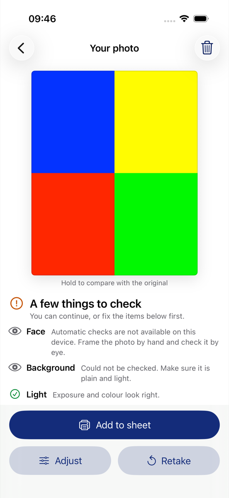 | 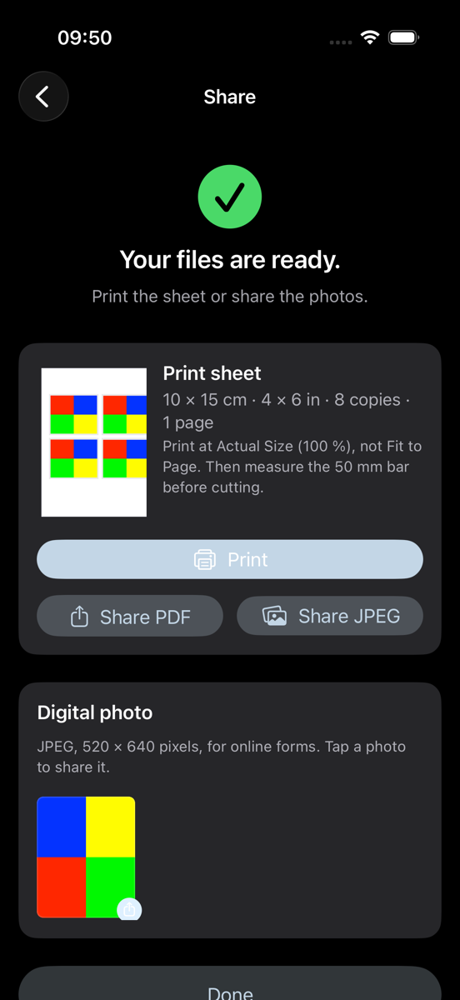 | 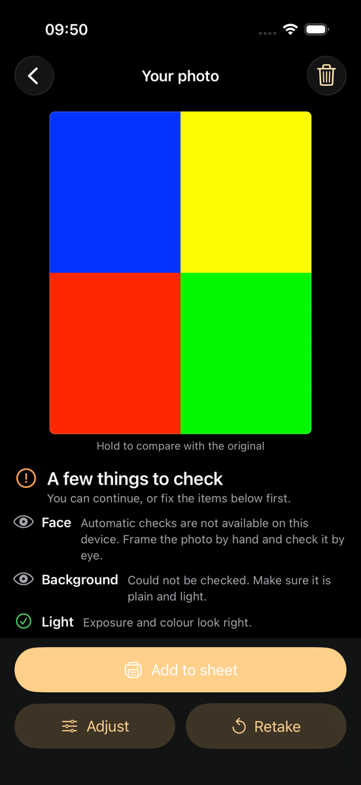 | 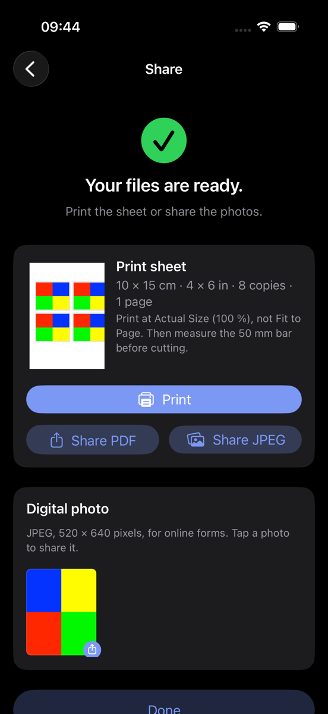 |

Consequence for the eventual colour system (whatever the hue): one accent value per appearance is not enough. Either the Dark/Increase-Contrast *fill* must stay dark enough for a white label (a separate "accent fill" role distinct from "accent text"), or prominent buttons need a dark label on light fills. This belongs in the Step 8 semantic-colour tokens. It is a palette-construction issue, not a reason to reject any hue.

Light + Increase Contrast behaves well for all four.

---

## 6. Answer to the question

> How little explicit branding is required for the product to still feel recognizably Calipic?

**Very little — and colour alone is not what does it.** The hypothesis in the handoff holds, with a sharper edge:

1. A single root tint is the entire in-app colour footprint: one filled button and a handful of labels per screen, zero surfaces. That is enough to stop the app from reading as "default iOS", and it costs nothing in native familiarity.
2. It is **not** enough to make a screen *recognizably Calipic*. With any of the four tints, a screenshot is still "a tidy iOS app". No candidate made the product identifiable on its own; the differences between A, B and C in context are much smaller than they look as swatches.
3. Therefore recognition has to come from the things the tint does not touch, used sparingly: the symbol/icon, the crop-frame motif around the portrait, the print sheet as the completion moment, and the voice of the copy. The in-app accent's job is narrower: be quiet, never impersonate a status colour, never disturb the judgement of skin and background.
4. Because the accent matters less in-product than expected, the colour decision can be weighted towards where colour *does* carry identity — the app icon and App Store presence — provided the in-app constraints above are met.

---

## 7. Provisional recommendation

Not a decision. BD-033 stays open and is the founder's call.

- **Carry B (dark cyan / blue-teal) and A (deep blue) forward as the two in-app accent finalists**, B slightly ahead on ownability, A ahead on safety and contrast. Retune B's dark value (deeper, less luminous) before the next round.
- **Keep C as the restraint benchmark rather than as a colour**: consider its discipline (neutral secondary controls, accent only on the one primary action) applied to A or B. That combination was not tested here and is the most promising next variant.
- **Drop D as an in-app accent** on evidence (warn collision, skin/cast proximity). It may still be explored for the icon only, per research §8.
- **For every finalist**, split the accent into text and fill roles so Dark and Increase Contrast prominent buttons keep a legible label (§5), and take the delete button off the brand tint.
- **Before any lock:** repeat this run on a device with real portraits across skin tones and common backdrop colours, the live camera overlay, grayscale and colour-vision-deficiency simulation, and alongside the icon matrix from Steps 1–3 — form and colour are to be selected together.

---

## 8. Reproduce

```sh
BRAND_REVIEW_INCREASE_CONTRAST=1 scripts/brand/export-brand-screenshots.sh 'platform=iOS Simulator,id=<simulator UUID>'
```

Manual look at one candidate: run the app with the launch argument `-brandCandidate B` (Xcode scheme arguments, or `xcrun simctl launch <UUID> com.jarbasferro.IDPhotoSpike -brandCandidate B`). `scripts/brand/generate-brand-assets.py` regenerates the colorsets and the placeholder icon if the test values change.
