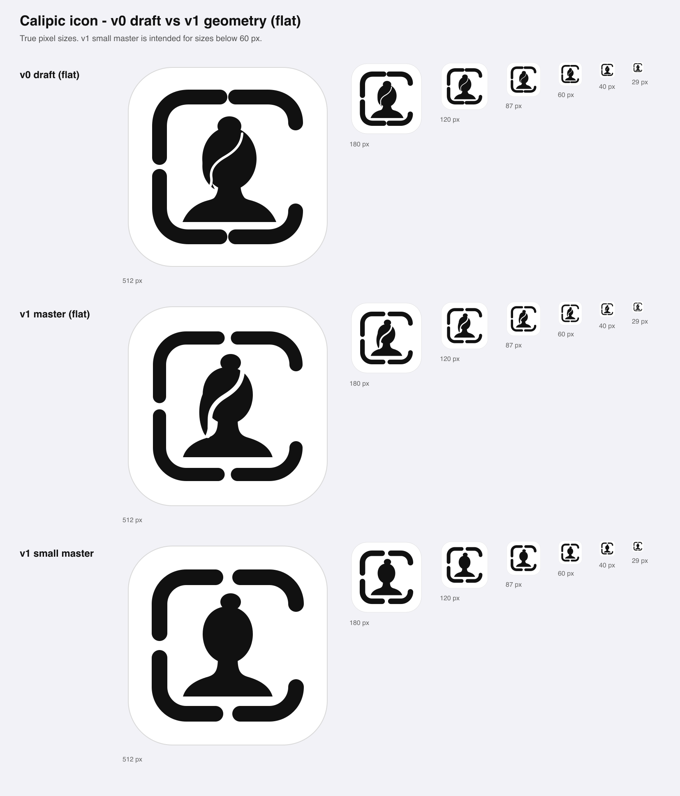
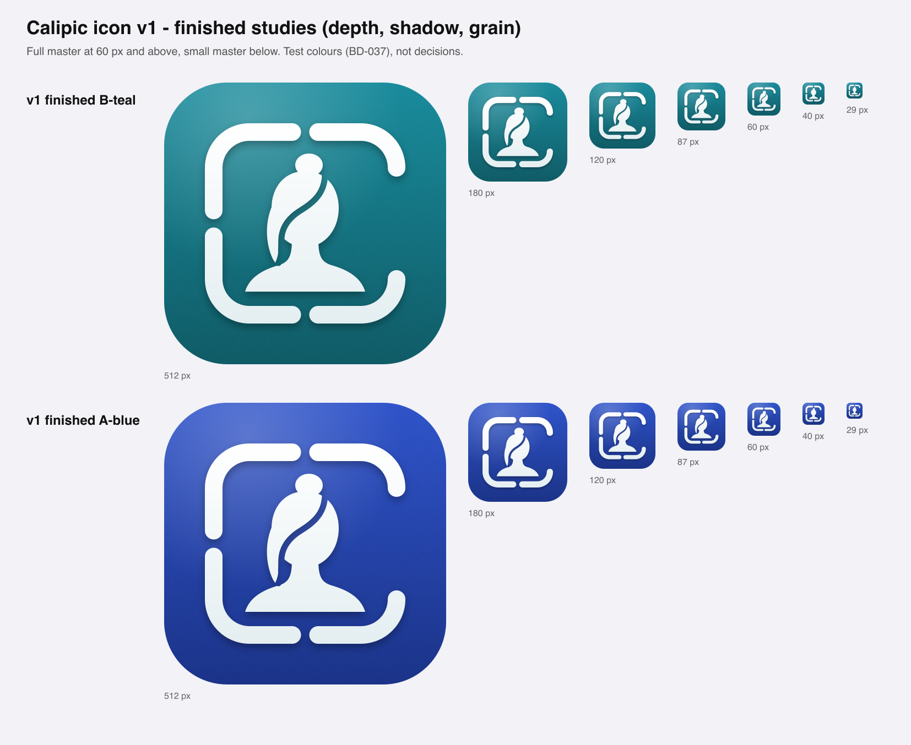

# Calipic — Icon refinement v1 (candidate)

**Status:** Refinement candidate for founder review — not a locked symbol (BD-036 stays Working)  
**Date:** 2026-09-17  
**Builds on:** [`02-icon-size-context.md`](02-icon-size-context.md) §refinement input, [`05-color-recommendation.md`](05-color-recommendation.md) §5  
**Command:** `scripts/brand/build-icon-v1.py` (stdlib + inkscape; regenerates everything in `icon-v1/` and both masters)

---

## 1. What this is

The founder flagged that the v0 icon is only a draft: the form needs substantial refinement and the final icon should have finishing (shadows, depth, texture). This is the first refinement pass **inside the frozen territory** — portrait bust in a crop frame that reads as a C. It is not a new logo round.

It delivers three things:

1. **`assets/calipic-icon-v1-master.svg`** — flat master, geometry exact by construction.
2. **`assets/calipic-icon-v1-small.svg`** — small-size master for renders below 60 px.
3. **Finished studies** in the two finalist colours (B blue-teal, A deep blue) with depth, shadow and grain — `icon-v1/v1-finished-*.svg`.

---

## 2. Geometry changes against the v0 draft (1024 canvas)

| Parameter | v0 draft | v1 master | v1 small | Why |
|---|---|---|---|---|
| Frame stroke | 72 | 64 | 76 | lighter, more elegant at large sizes; heavier where pixels are scarce |
| Net gap, top / bottom / left | 4 / 4 / 20 (unequal) | **30 / 30 / 30** | 44 | v0 gaps never resolved at shipping sizes; handoff requires equal small gaps |
| Corner radius | 136 × 126 (non-circular, top-right differs from top-left) | **130, identical on all four** | 130 | handoff: identical radii |
| Mirror symmetry about y = 512 | approximate | **exact (generated)** | exact | handoff requirement |
| Right opening (net) | 356 | 340 | 328 | still > 10× a small gap, so the C reads first among the gaps |
| Bust base to frame inner edge | 36 | **52** | 46 | v0 visually touched the frame at 29 px |
| Hair strand | 12, painted stroke | **22, true cut-out** | omitted | 12 failed at ≤ 40 px and read as damage at 29 px |
| Head | plain ellipse | egg-shaped (fuller crown, narrower jaw) | same | less "Contacts avatar" |
| Neck / shoulders | separate overlapping shapes | one continuous curve, flat print-like base | same | curve continuity |
| Loose lock | small side mass | tapered lock past the jaw, separated by the strand | omitted | keeps the signature detail readable |

The frame is generated from one set of numbers and mirrored, so stroke, radii, caps and gaps cannot drift apart.

---

## 3. Measured effect (same script as round 1, candidate B, treatment 2)

Gap openness: 0 = closed, 1 = fully open. Source: `icon-sizes/metrics.tsv` (v0) and `icon-v1/icon-sizes/metrics.tsv` (v1 master).

| Size | v0 top/bottom gap | v1 top/bottom gap | v0 left gap | v1 left gap | v0 strand contrast | v1 strand contrast |
|---|---|---|---|---|---|---|
| 180 px | 0.39 | **1.00** | 1.00 | 1.00 | 1.00 | 1.00 |
| 120 px | 0.29 | **1.00** | 1.00 | 1.00 | 1.00 | 1.00 |
| 87 px | 0.52 | **1.00** | 1.00 | 1.00 | 0.96 | 1.00 |
| 60 px | 0.21 | **0.92** | 0.63 | 0.92 | 0.75 | **0.99** |
| 40 px | 0.20 | 0.75 | 0.53 | 0.75 | 0.55 | 0.84 |
| 29 px | 0.55 | 0.97 | 0.84 | 0.97 | 0.41 | 0.68 |

- The three small gaps are now **equal and visible down to 60 px**; in v0 the top and bottom gaps were effectively closed at every shipping size.
- The strand holds full contrast to 60 px. At 40 px and 29 px it is still degraded — which is why the **small master drops it**; use the small master below 60 px.
- The right opening stays fully open at every size in both versions.

The full re-run on the v1 master is in `icon-v1/color-matrix/` (contact sheets) and `icon-v1/icon-sizes/sheets/` (Home Screen, App Store, Settings/Spotlight, strips). The colour findings of round 1 are unchanged by the new geometry; the accessibility run (03) is colour-only and was not repeated.

---

## 4. Finishing approach

Restrained, three layers, no gloss:

1. **Lit field** — vertical gradient within one hue (lighter top, deeper bottom) plus a soft top-left light.
2. **Paper grain** — fine monochrome noise at 10 % over the field only: a nod to photo paper, invisible below ~120 px by design.
3. **Mark with contact shadow** — white mark with a faint cool falloff toward the bottom, and a soft 14-unit drop shadow so the frame and bust sit just above the field. The strand is a true cut-out, so the field shows through it.

Deliberately avoided: bevels, inner glows, specular streaks, multi-hue gradients, sparkle — all of which read as AI/gradient branding or fight iOS 26, where the system adds its own Liquid Glass highlights to layered icons.

**Production note:** the shipping icon for iOS 26+ should be authored as **layers in Icon Composer** (background field; mark as foreground layer) so the system supplies specular light, and the dark / tinted / clear appearances. The baked shadow and grain in these studies show intent; in the layered asset the system shadow replaces the baked one. The flat masters are the source for those layers.

---

## 5. Open points for the founder

1. **Silhouette direction.** The side-swept hair + bun keeps the v0 personality and still reads female-presenting. The handoff asks for an international/category neutrality check before lock. The small master (no strand, no lock) is noticeably more neutral — one option is to make *that* bust the primary and keep the strand as a large-size detail only.
2. **Stroke weight.** 64 is more elegant at 1024/180; if the Home Screen read feels thin next to heavy neighbours, 68–72 is a one-number change in the `Spec`.
3. **Optical centring.** The open right side makes the mark feel slightly left-heavy. `Spec.shift_x` exists for this; left at 0 pending your eye.
4. **Lock tip.** The tapered lock ends in a fine point near the shoulder; it can be blunted if it feels fussy.
5. **Colour** remains open (BD-033): both finalists are rendered so the decision can be made on the refined form.

---

## 6. What is not done

- Not an Icon Composer asset; no dark/tinted/clear appearance renders yet.
- Not hand-tuned in a vector editor — curves are clean cubic Béziers from code, and a designer's optical pass is still worthwhile before lock.
- The in-app placeholder `AppIcon` still uses the v0 draft; it should switch only after the form is approved.
