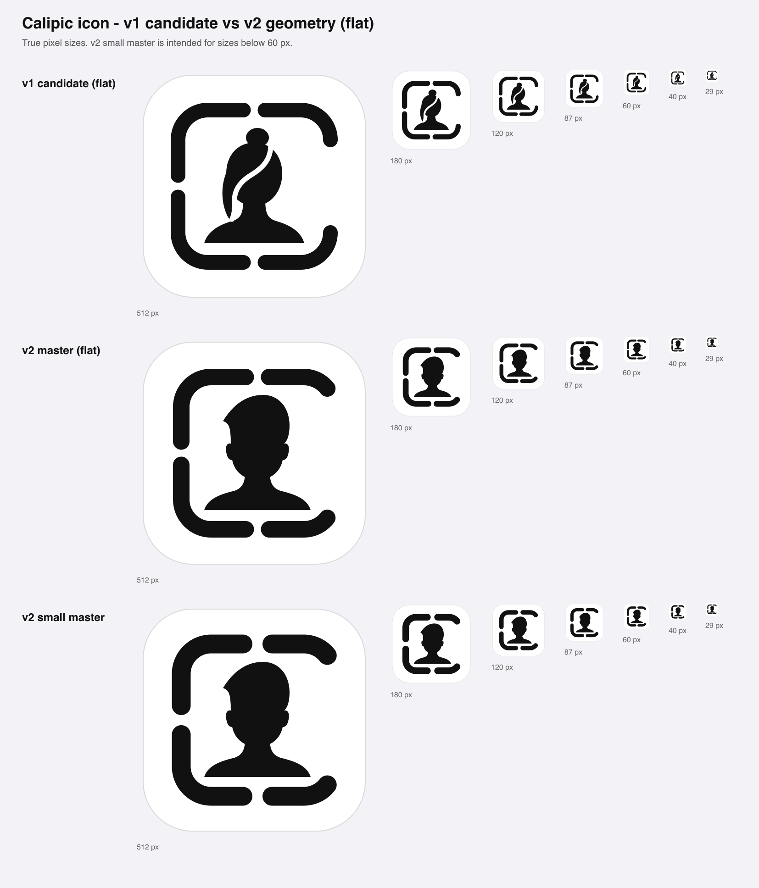
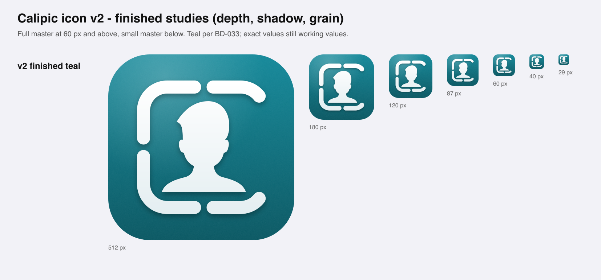
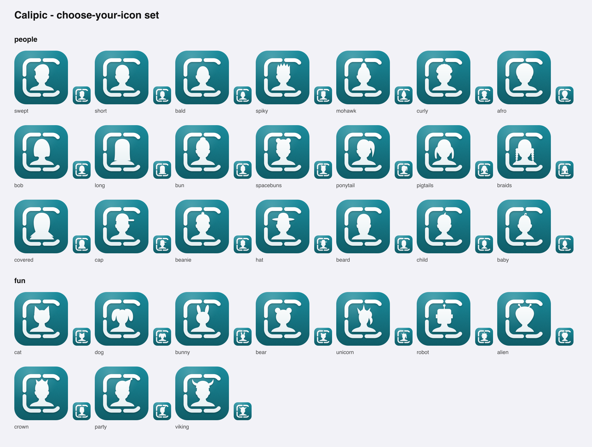
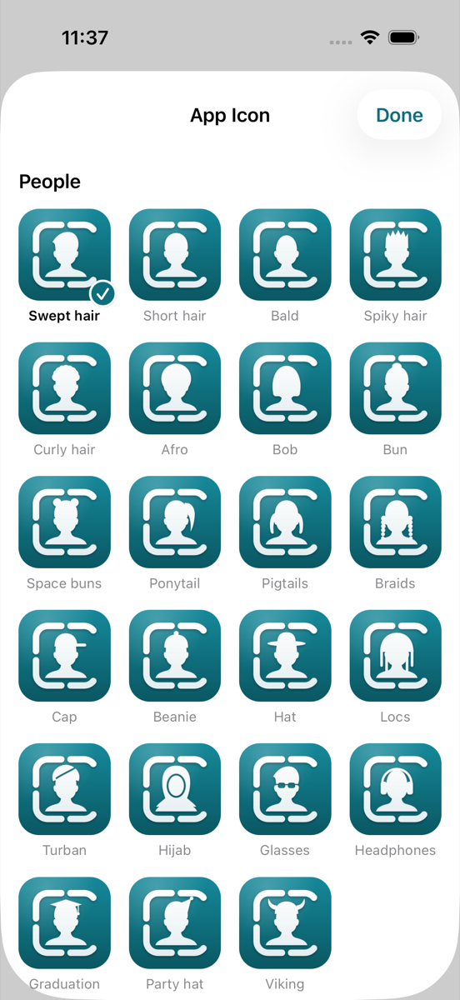
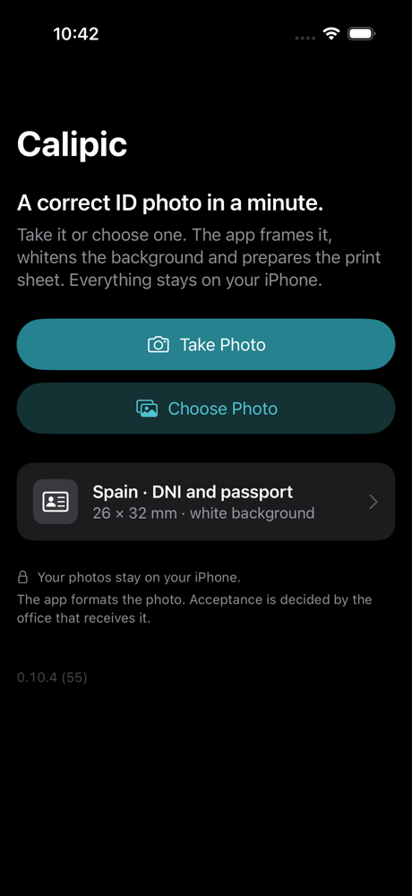
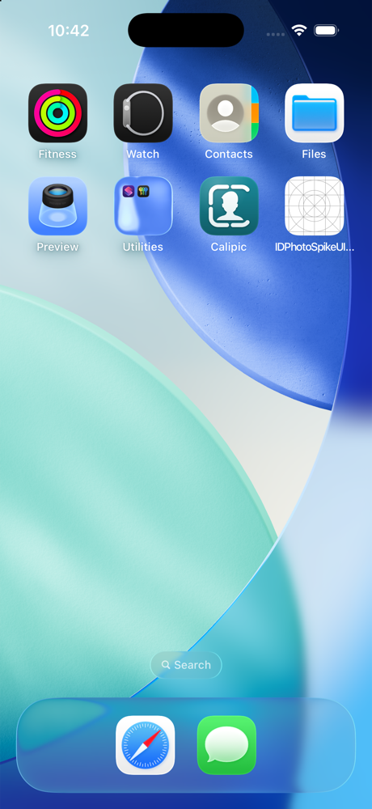
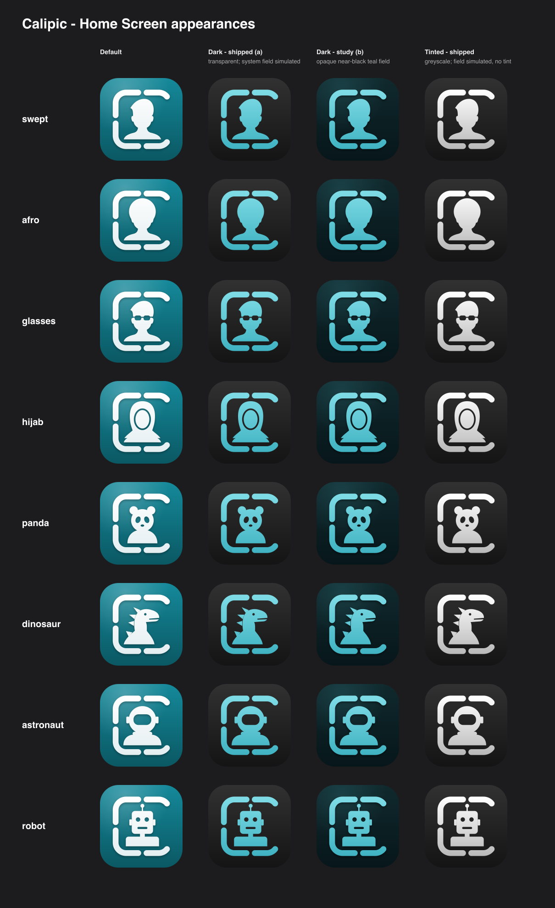
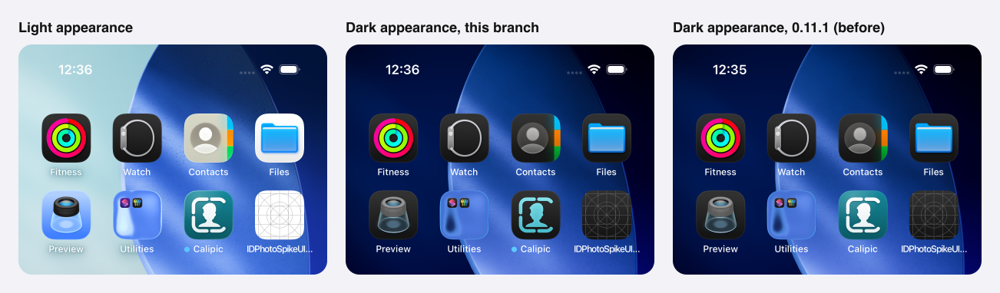
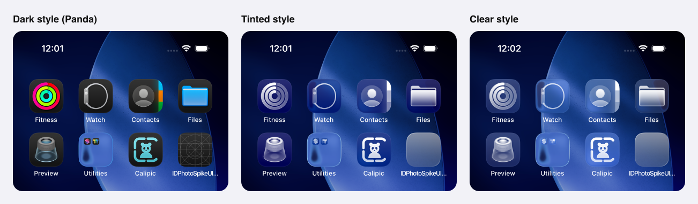

# Calipic — Icon v2 (simpler silhouette, stronger C, teal) and choose-your-icon

**Status:** Candidate for founder review — symbol form not locked (BD-036 stays Working)  
**Date:** 2026-09-17  
**Follows:** [`06-icon-refinement-v1.md`](06-icon-refinement-v1.md)  
**Command:** `scripts/brand/build-icon-v2.py` (stdlib + inkscape; regenerates `icon-v2/` and the v2 masters)

---

## 1. Founder direction applied (2026-09-17)

After reviewing v1 the founder asked for three changes, and then proposed a fourth idea:

1. **A simpler silhouette** — a plain, neutral bust (reference: a generic swept-hair avatar silhouette) instead of the bun + loose strand. The v2 bust is an original drawing in that spirit, not a trace of the reference.
2. **The thicker stroke** — 72 units (v1 used 64).
3. **A wider right-hand gap to reinforce the C** — the right corners now stop after 52° of arc instead of 90°, so the opening runs almost the full height of the frame.
4. **Teal** as the brand colour (recorded in BD-033).
5. **Idea: let people choose their app icon** — see §4.

---

## 2. Geometry (1024 canvas)

| Parameter | v1 | v2 master | v2 small (< 60 px) |
|---|---|---|---|
| Frame stroke | 64 | **72** | 82 |
| Net gap top / bottom / left | 30 | 30 | 44 |
| Right corners drawn | 90° (full corner) | **52°** | 52° |
| Right opening, net | 340 | **≈ 490** | ≈ 480 |
| Optical shift to the right | 0 | **14** (balances the open side) | 14 |
| Bust | bun, egg head, strand cut-out, lock | **one plain bust: swept hair, ears, neck, broad shoulders, flat base** | same |
| Signature strand | 22-unit cut-out | removed | removed |

Everything else keeps the v1 rules: identical radii (130), exact mirror symmetry about the horizontal centre line, identical round caps, generated from one `Spec`.

**Measured** (same script as round 1, teal, white mark on field; openness 0 = closed, 1 = open):

| Size | top/bottom gap | left gap | right opening |
|---|---|---|---|
| 180–80 px | 1.00 | 1.00 | 1.00 |
| 60 px | 0.98 | 0.91 | 1.00 |
| 40 px | 0.97 | 0.65 | 1.00 |
| 29 px | 0.71 | 0.95 | 1.00 |

(Master geometry at all sizes; the small master, with 44-unit gaps, is what should ship below 60 px.) Context sheets for the v2 master are in `icon-v2/icon-sizes/sheets/`.

**What the simpler bust buys:** no detail that can fail at small sizes, a more neutral read, and a clear visual hierarchy — frame, person, C — with the C now legible without explanation. **What it costs:** the bust alone is no longer ownable; ownability now rests on the C-frame (and on colour + finish). That trade is consistent with BD-021/BD-022 and makes §4 possible.

---

## 3. Finish

Unchanged from v1: lit single-hue teal field (`#15899A` → `#0A5863`, around the accent `#0E6F7C`), 10 % paper grain on the field, white mark with a faint cool falloff and a soft contact shadow. For iOS 26+ the shipping asset should be layered in Icon Composer (field / mark) so the system supplies highlights and the dark, tinted and clear appearances.

---

## 4. Choose your icon

**Idea (founder):** let people pick the app icon that suits them — a fun touch.

**Why it fits Calipic:** the frame-C is the constant brand element; the person inside is a slot. Swapping the person personalises the icon without diluting recognition, and it dissolves the open neutrality question from the handoff (§4: the v0 silhouette read female-presenting) — no single bust has to represent everyone. It also suits the audience lens in BD-016 (parents making photos for the family).

**Founder decision (2026-09-17):** frame approved, "swept" stays the default, and the set should be as diverse as possible and end with a playful group.

**Second pass (founder, 2026-09-17):** remove anything that does not read clearly at Home Screen size, and try the suggested additions.

- **Removed:** long and covered (solid hair/fabric became a plain block), unicorn (front view was only a horn and a mane), dog (floppy ears read as pigtails), mohawk and crown (too little headroom under the frame), beard, child and baby (indistinguishable from short / bald at 180 px).
- **Added:** locs, turban, hijab, glasses, headphones, graduate; fox, panda, frog, dinosaur, astronaut.
- **New technique — cut-outs.** A character may carry negative-space details (5th element of a `VARIANTS` entry): glasses, the turban fold, the hijab's face opening, panda eye patches, frog pupils, the dinosaur's eye and mouth, the astronaut's visor. Flat masters paint them in the field colour; finished icons mask them so the lit teal shows through. This is what makes characters readable that a plain silhouette cannot express.

The set now has **33 characters** — 23 people and 10 fun. Everyone sits on the same shoulders and base line inside the same frame; people share one head with ears, so only hair, headwear or accessories change.

- **People:** swept (default), short, bald, spiky, curly, afro, bob, bun, spacebuns, ponytail, pigtails, braids, cap, beanie, hat, locs, turban, hijab, glasses, headphones, graduate, party, viking.
- **Fun:** cat, bunny, bear, fox, panda, frog, dinosaur, astronaut, robot, alien.

**Third pass (founder, after trying 0.11.0 on device, 2026-09-17):**

- **Names under each icon** in the picker (caption, up to two lines, the selected one emphasised) so a character is understood at a glance; the same string is the VoiceOver label.
- **Fun characters no longer sit on human shoulders** — that looked strange. Each now has a body of its own kind on the same base line (`BODIES` in the script): a soft neckless mound for cat, bunny, fox (slim) and bear, panda (round); a squat body for the frog; a sloping back with spikes for the dinosaur; boxy shoulders and a neck post for the robot; a thin neck and narrow shoulders for the alien; a suit with a collar ring for the astronaut.
- **Simple cut-out faces** (eyes, nose; a mouth for the robot) on the animals, robot and alien, so they read as characters rather than blobs.
- Party hat and viking are people in costume: they keep human shoulders and moved to the end of the People group.

Assessment: all 33 are identifiable at 180 px. Closest pairs to watch: short / bald, afro / bob, cat / fox. **Locs** is the least confident drawing (strands hanging beside the face, separated by gaps) and would benefit most from a designer's hand; representation there deserves better than my geometry. Below 60 px everything converges to "a character in a C", which is fine — the choice is for the Home Screen.

**Implementation notes (written before the build; see "Implemented" below):**

- iOS alternate icons: `UIApplication.shared.setAlternateIconName(_:)`; each alternate is an app-icon set in the asset catalog, listed via `ASSETCATALOG_COMPILER_ALTERNATE_APPICON_NAMES` (+ `ASSETCATALOG_COMPILER_INCLUDE_ALL_APPICON_ASSETS = YES`). iOS shows a system alert when the icon changes; that is expected and cannot be suppressed.
- Placement: a quiet "App Icon" row in the app's settings/about area with a grid of the icons — never in the capture → check → print path (Experience Constitution: nothing between the person and the finished photo).
- The App Store listing, marketing and the wordmark lock-up always use the **default** icon.
- Keep every icon structurally identical; colour stays teal for all — colour choice is not offered, so the brand colour keeps its recognition job. With 33 icons, watch app size: render alternates without the grain layer or as layered Icon Composer files if the PNGs get heavy.
- Guardrails from BD-023 still apply to every variant: no Face ID, surveillance, Contacts-avatar or character-illustration look. No skin, no facial features, no accessories that imply religion, age or profession.
- Every alternate needs the same dark / tinted / clear appearances as the default.

**Implemented (2026-09-17):** choose-your-icon ships in the app.

- **Where:** a quiet "App Icon" row above the version line on Home opens a sheet titled "App Icon" with two sections, "People" and "Just for fun", and a grid of the icons. The current icon carries a checkmark badge and the VoiceOver "selected" trait; every icon has a spoken label in en, es and pt-BR. The row is hidden when the system does not support alternate icons, and nothing appears in the capture → check → print path. The selection is read from the system (`UIApplication.alternateIconName`); the app stores nothing. Code: `App/Brand/AppIconChoice.swift`, `App/Features/AppIconPickerView.swift`.
- **Assets are generated:** `scripts/brand/generate-brand-assets.py` imports `VARIANTS` from `build-icon-v2.py` and writes the primary `AppIcon` (swept), one alternate `AppIcon-<name>` per other character (a 1024 px image without alpha; since the update in §7 also a dark and a tinted one), a 240 px pre-masked `IconPreview-<name>` for the picker, the Swift list `App/Brand/AppIconCatalog.swift`, and the value of `ASSETCATALOG_COMPILER_ALTERNATE_APPICON_NAMES` in the project (Debug and Release). The old placeholder PNG is gone.
- **Size:** with the grain layer the icons weigh about 890 KB each (≈ 29 MB for 33). All app icons are therefore rendered **without grain and without dithering**, consistently: **3.42 MB for the 33 × 1024 PNGs** plus 0.68 MB of previews in the repository; the compiled `Assets.car` of the app is 6.1 MB. (With the dark and tinted images of §7: 5.65 MB and 7.8 MB.) Grain returns when the icons become layered Icon Composer files (open point 4).
- **Adding or removing a character:** one `VARIANTS` entry → run `scripts/brand/generate-brand-assets.py` → add (or delete) the label `AppIcon.<name>` in `Localizable.xcstrings` with en, es and pt-BR. `generate-brand-assets.py --check`, `scripts/brand/test_generate_brand_assets.py` and `AppIconChoiceTests` fail if the build settings, asset catalog, Swift list, labels or the built Info.plist disagree with `VARIANTS`.
- ~~**Not done yet:** dark / tinted / clear appearances and the small-size master below 60 px.~~ **Update 2026-09-17:** dark and tinted appearances ship for all 33 icons, and the small-size question is answered — see §7. The layered Icon Composer asset (clear / Liquid Glass) is still open.
- **Verified** on the iPhone 17 simulator (iOS 26.5): the built Info.plist lists all 32 alternates; choosing "Panda" changed the Home Screen icon after the system alert, and choosing the default put it back.

---

## 5. Open points

1. ~~Frame~~ — **approved 2026-09-17.** ~~Default bust~~ — **swept, confirmed.**
2. Designer pass, starting with locs; a readable child and beard (both need more than a silhouette — perhaps cut-outs); further additions.
3. Exact teal values (light `#0E6F7C`, dark `#4FC3D1`, fill roles) remain working values until tested on device.
4. ~~Dark / tinted appearances for the default and every alternate~~ — **done 2026-09-17 through the asset catalog (§7)**. Still open: the layered Icon Composer asset (field / mark) for the clear / Liquid Glass look and for getting the grain back. The Clear style already renders acceptably from the transparent images (§7), so this is a finish question, not a gap.
5. ~~Small-size master below 60 px in the app icon~~ — **investigated 2026-09-17, not shipped on purpose (§7).**

---

## 6. In the app (2026-09-17)

Teal is now the app's real accent (`App/Brand/BrandRoles.swift`: `Brand.accent`, `Brand.accentFill`), with the separate fill role for filled buttons, neutral destructive toolbar items, and status colours untouched. The Debug-only `-brandCandidate` hook remains for comparisons. The app icon is the v2 finished teal set of §4 (generated, without grain).

| Home, Dark Mode | Home Screen (simulator, iOS 26.5) |
|---|---|
|  |  |

Note how the icon separates from Contacts on the same row: the C-frame and teal do the work, not the bust.

---

## 7. Dark and tinted appearances, and the small-size question (2026-09-17)

Until now every app-icon set held one 1024 image, so on a Dark or Tinted Home Screen iOS invented its own version of the teal square. Each of the 33 sets now carries **three 1024 universal iOS images** — default, `luminosity = dark`, `luminosity = tinted` — generated by `scripts/brand/generate-brand-assets.py` (`appearance_svg()`), which reuses the frame, bust and cut-out mask of `build-icon-v2.py` unchanged. No Icon Composer file is involved. The default image is byte-identical to before.

(Redraw with `scripts/brand/generate-brand-assets.py --appearance-sheet`. The grey field behind the transparent columns is a stand-in for the system's; the real one is in the screenshots below.)

### Dark — two options rendered and compared

| | (a) transparent background — **shipped** | (b) opaque near-black teal field — study only |
|---|---|---|
| Mark | light teal, `#7FDCE6` → `#3FB2C1` (the BD-033 dark accent `#4FC3D1` sits inside this falloff) | same |
| Field | none: the system supplies its dark field | `#10292D` → `#07161A`, a faint teal light from the top left, contact shadow |
| Cut-outs | real transparency — the system field shows through glasses, visor, eye patches | masked, the teal-black field shows through |

**Chosen: (a).** Reasons: it is what Apple's guidance asks for (omit the background of the dark icon so the system background shows through), so Calipic sits on exactly the same field as the system apps beside it instead of a slightly-off teal-black square; the system, not a baked square, decides how the field looks in each iOS version; the same transparent mark also gives a correct **Clear** style for free (see the screenshot — not something an opaque image can do); and it is smaller (≈ 35 KB instead of ≈ 100 KB per icon). What (b) would buy — a hint of teal in the field — is carried by the mark itself, which is unmistakably teal at Home Screen size. The contact shadow is dropped in (a): on a near-black field it is invisible, and as alpha it would only dirty the system field. (b) stays in the script as `opaque_field=DARK_FIELD` so the comparison can be redrawn.

### Tinted

Greyscale only — white `#FFFFFF` → light grey `#B9B9B9`, top to bottom — on a transparent background, no contact shadow: as black alpha it takes no tint and would only darken the system field around the mark. The system supplies the dark field and the colour. The vertical falloff survives tinting as a gentle gradient in the chosen colour.

### Verified on the iPhone 17 simulator (iOS 26.5)

- `assetutil --info Assets.car`: every icon has three `Icon Image` renditions at 1024 px — appearance none (opaque), `UIAppearanceDark` and `ISAppearanceTintable` (both with alpha). No `actool` warnings.
- `xcrun simctl ui <id> appearance dark` with the Home Screen style **Dark → Auto** shows the dark variant, and the default one again in light appearance. Note that the style **Default** keeps light icons even in Dark Mode; that is the system's behaviour, not the asset's. The third panel is the same Home Screen with the 0.11.1 build, where iOS had only the teal square to work with:

  
- The Home Screen styles cannot be set with `simctl`. They were driven once through SpringBoard's own *Edit → Customize* panel with a throw-away XCUITest (not committed: it automates system UI that changes between iOS versions). Result, with the **Panda alternate** selected so that an alternate icon and its cut-outs are covered too:

### Size

| | repository (33 icons) |
|---|---|
| default 1024, RGB | 3.43 MB (unchanged) |
| dark 1024, RGBA | 1.15 MB |
| tinted 1024, RGBA | 1.07 MB |
| **app icons total** | **5.65 MB** (budget ≈ 12 MB) — plus 0.68 MB of picker previews |

The compiled `Assets.car` grows from 6.1 MB to 7.8 MB. No quantising was needed: a flat mark on transparency compresses well.

### Guard rails

A set without all three appearances now fails in three places: `generate-brand-assets.py --check` (missing file, wrong pixel format — the default must be RGB without alpha, dark and tinted RGBA — a `Contents.json` that differs from the generated one, or a stray file in a set), `test_generate_brand_assets.py` (the same on a damaged copy of the catalog, plus: dark and tinted use exactly the glyph and cut-out mask of the default icon, nothing is painted behind them, and the tinted image contains no colour), and `AppIconChoiceTests.everyAppIconSetHasDefaultDarkAndTintedImages`.

### Small sizes (< 60 px): finding — do not ship per-size images

The small master (`Spec SMALL`: 82 stroke, 44 gaps) is meant for renders below 60 px. Time-boxed investigation of whether the asset catalog can use it:

1. **Explicit per-size sets and appearances exclude each other.** A classic app-icon set (`idiom: iphone` 20/29/40/60 pt entries + `ios-marketing` 1024) compiles, but `actool` (Xcode 26) then **drops every dark and tinted image**, including the 1024 ones; `appearances` on sized entries are ignored silently. Going per-size would undo this whole section.
2. **Mixing works on paper only.** Adding `iphone` 20/29/40 pt entries next to the three universal 1024 images compiles without warnings, and the small default renditions do land in `Assets.car` (dark/tinted small ones are again dropped). But iOS 26.5 **does not use them**: with magenta marker images in the 20/29/40 pt slots of the primary icon, Settings → Apps still drew the teal icon scaled from the 1024 image, also after a simulator reboot. The system renders every size from the 1024 source (it has to, to apply its masks, glass edge and appearances).
3. **The affected sizes barely exist.** On @3x iPhones the smallest icon is the 20 pt notification icon = 60 px, the threshold where the full master is already specified as good enough (§2: openness ≥ 0.91 at 60 px). Only the @2x devices that still run iOS 26 (iPhone 11, SE 2/3) go below: 40 and 58 px.

**Recommendation:** keep the single-size 1024 sets. Do not add per-size images — not for the primary icon either: they are ignored by the system and would make light and dark inconsistent if a future iOS did honour them. Keep `calipic-icon-v2-small.svg` for what it is good at — places where *we* render the mark small (in-app glyphs, favicon, documents, App Store artwork insets). If small-size legibility on the Home Screen ecosystem ever needs work, the lever is the 1024 geometry itself (or the Icon Composer file), judged at 58–60 px.
