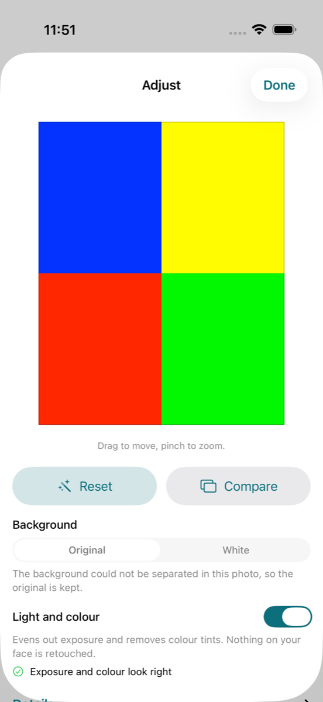
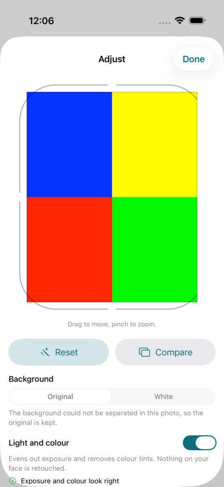
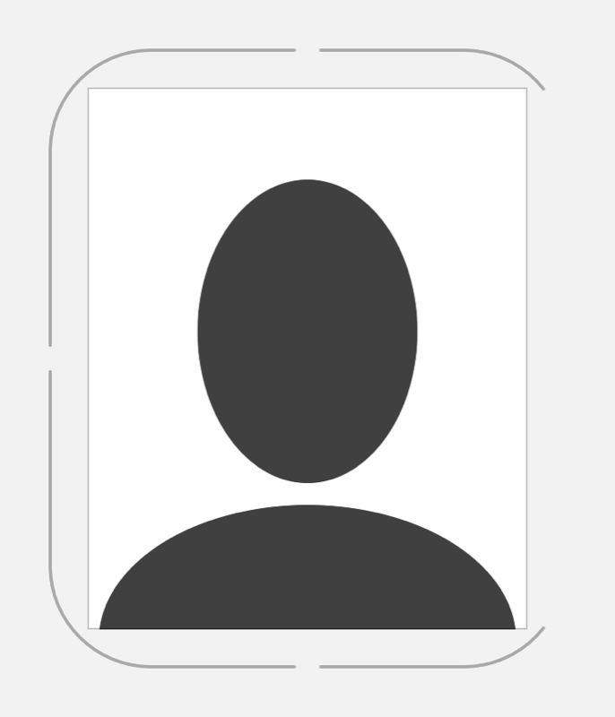
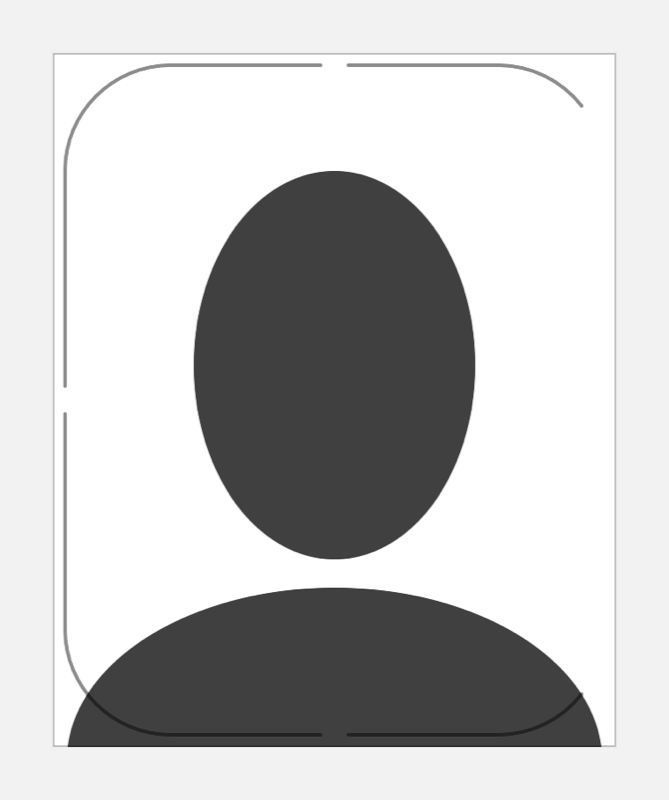
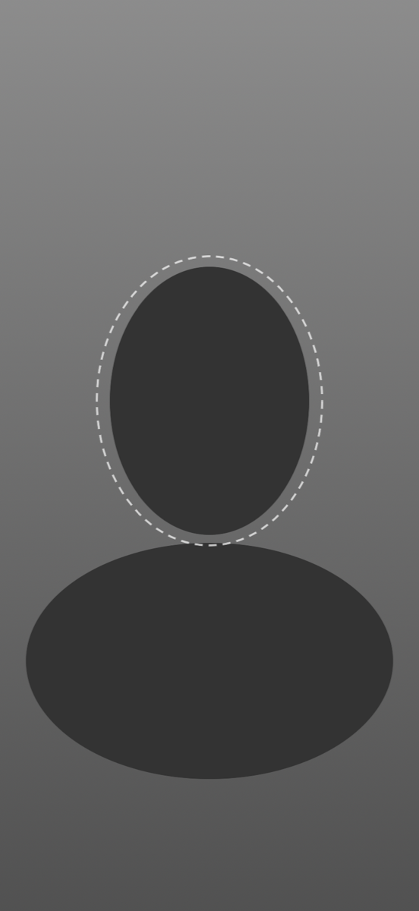
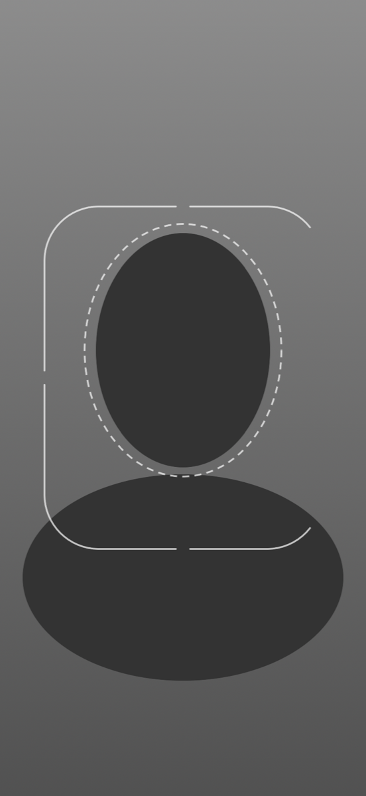
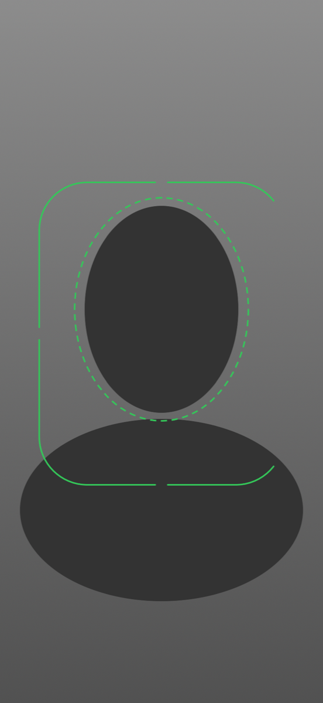

# Calipic — The C-frame as a product detail (prototype)

**Status:** Evidence and recommendation — one placement kept, one rejected; nothing here is a brand decision  
**Date:** 2026-09-17  
**Follows:** [`04-product-context.md`](04-product-context.md), [`05-color-recommendation.md`](05-color-recommendation.md) §4 finding 2, [`07-icon-v2-and-icon-choice.md`](07-icon-v2-and-icon-choice.md)  
**Code:** `App/Brand/CalipicFrame.swift`, `App/Camera/CameraFramingGuide.swift`, `Tests/CalipicFrameTests.swift`  
**Question:** *Can the icon's crop frame become one of the "very small number of strong details" (BD-018) inside the product, without adding chrome and without getting in the way of the portrait?*

---

## 1. Why this was tried

Round 1 showed that a root tint stops the app looking like default iOS but does not make a screen recognisably Calipic (05 §4.2): recognition "has to come from the symbol, the crop-frame motif, the print sheet and the voice". BD-020 lists crop corners and framing as promising motifs. The icon's one fixed element (BD-036, BD-038) is a rounded crop frame that reads as a capital `C`. The product already draws frames in two places — the crop in the editor and the framing guide in the camera — so the test was to let the brand frame *be* those guides rather than to add anything.

Rules set before looking at any screen:

- the frame never covers the face area and never competes with a status colour;
- over a photo it is white, neutral or the existing status colour — **never teal over a portrait**;
- no new animation; Reduce Motion, Increase Contrast and VoiceOver are respected (the frame is decorative and hidden);
- if it hurts the task, it goes.

---

## 2. The shape

`CalipicFrame` is a SwiftUI `InsettableShape` with the icon's construction (`frame_paths` in `scripts/brand/build-icon-v2.py`), expressed as ratios so it fits any rectangle:

| Parameter | Icon master (1024 canvas) | Shape default |
|---|---|---|
| Corner radius | 130 on a 664 frame | `cornerRatio` = 130 / 664 of the shorter side |
| Small gaps (top, bottom, left centres) | 30 visible, between round caps | `gapRatio` = 30 / 664 of the shorter side, plus the caller's `lineWidth` so the *visible* gap is kept |
| Right-hand corners | drawn for 52° of 90° | `rightSweepDegrees` = 52 |
| Stroke | 72, round caps | chosen by the caller; `strokeStyle()` gives round caps and joins |

Unit tests pin the geometry: the icon master numbers are reproduced exactly (gap ends at 512 ± 51, corner end at the sin/cos of 52°); the three gaps are equal and sit on the centre lines for square, portrait and landscape rectangles; the stroked outline is an exact top/bottom mirror image; the right side is open between the corner ends while the left side is drawn; degenerate sizes stay finite. The shape does not flip in right-to-left layouts: it is a letterform.

`CalipicFrameGuide` is the shape as a guide: 2 pt line (`Design.Stroke.guide`), 3 pt under Increase Contrast, no hit testing, hidden from assistive technologies, colour supplied by the caller.

---

## 3. Placement 1 — the crop in the editor: **did not work, reverted**

The editor's existing guide is a 1 pt hairline on the true edge of the crop. Two ways of bringing the frame in were built and looked at.

| Before (shipping) | Frame around the photo, in the running app | 
|---|---|
|  |  |

| A. Around the photo, with enough clearance to miss the corners | B. On the photo, inside the crop edge |
|---|---|
|  |  |

(The running-app screenshots use the repository's four-colour geometry fixture; A and B are off-screen renders over a neutral stand-in bust, because the repository holds no portraits.)

What the screenshots show:

1. **A rectangle does not fit inside a frame with a 20 % corner radius.** In the icon the content is an organic bust that tucks into the rounded corners. A crop is a hard rectangle. With a modest clearance (14 pt, middle screenshot) the photo's corners poke through the frame's corners and the result looks like a drawing error. Clearing them needs about 24 pt on every side (A): 48 pt of height on the one screen where height is scarcest, and the Details control is pushed further below the fold.
2. **Around the photo it is chrome.** Version A is tidy, and it does look like the icon. But it is a second frame around a frame, it says nothing about the crop, and its gaps and open side mean nothing to someone positioning a face. That is "branded chrome" in the sense the constitution rules out (rule 5), on a screen whose guides "exist to help the photo, not decorate it" (rule 3).
3. **On the photo it misinforms.** Version B puts a rounded, asymmetric outline inside a crop that is rectangular and symmetric. It reads as a safe area that does not exist, it crosses the shoulders, and the open right side reads exactly as feared: a broken guide. It also has the white-on-white problem (the finished background is white, so the line has to be dark, which is heavier over a face than the hairline it replaces). This conflicts with rule 2 — precision must be real.

**Outcome:** the editor keeps its hairline; `CropPreview` and `AdjustSheet` are unchanged on this branch. The motif should not be retried here with a smaller radius or a closed right side: at that point it is no longer the Calipic frame, only a rounded rectangle.

---

## 4. Placement 2 — the guided camera: **kept, unverified on device**

| Before: the dashed oval alone | After, while framing | After, ready |
|---|---|---|
|  |  |  |

(Off-screen renders of the `#Preview` scene in `CameraFramingGuide.swift` at iPhone Air size — a grey wall and a plain bust stand in for the live view. A simulator has no camera.)

What changed: the dashed head oval is untouched — same size, same place, same dash, same colours — and stays the thing every hint talks about ("Show your face in the oval"). Around it now sits the Calipic frame, with the photo's 26 : 32 proportions, sized and placed from the same composition targets the crop solver uses (`CompositionSpec`: head height 0.74 of the photo, eye line 0.42 from the top). It takes exactly the oval's colour: white at 70 % while framing, `StatusStyle.pass` when every check is ready, with the existing 0.2 s colour transition (none under Reduce Motion). Under Increase Contrast both lines go to 3 pt and full white. The guide is hidden from VoiceOver as before; the hint label and the shutter's accessibility value carry the state.

Why it works here when it failed in the editor:

- **The content is organic.** A head and shoulders inside the rounded frame is literally the app icon. It is the one moment in the product where the symbol appears at full size, made of the user's own picture — and it costs no new element, colour or word.
- **It adds information.** The oval alone says where the head goes. The frame says roughly how much of you ends up in the photo, which is the question behind "move closer / farther". It is a composition aid and approximate by nature, so an open side misstates nothing — unlike a crop edge.
- **It stays out of the face.** The frame clears the oval on every side at every portrait iPhone size (tested from 320 × 568 to 420 × 912) and never crosses the face area; the top hint and the shutter sit outside it. Where it has no room — landscape, where it would run under the hint and the shutter, or a view too narrow for the photo's proportions — it is not drawn at all, and the oval is never moved or shrunk to make room for it (`CameraFramingGuide.Layout`, unit-tested).
- **It does not fight status colour; it carries it.** Green-when-ready now has more line to show on, which should be easier to notice at arm's length. Colour is still not the only signal (ring, hint text, haptic, VoiceOver).

Risks that a simulator cannot answer — **this overlay is unverified on device**:

1. Over a real, busy live view a 2 pt white line may be too quiet or, with the oval, too much. If it is too much, thin the frame before touching the oval.
2. People may treat the frame as the exact crop. It is not (the solver crops from the detected face); if that confusion shows up in testing, the frame goes.
3. The two-line hint label comes close to the frame's top edge on the smallest iPhones; the label sits above it on a material, so it stays readable, but it needs a look.
4. Whether the open right side reads as "C" or as "unfinished" with a real face in it. In the render it reads as the icon; a founder/device check should confirm.

---

## 5. Recommendation

1. **Keep the frame in the guided camera, pending a device check** of the four risks above. It is the strongest and cheapest expression of the symbol in the product, and it is doing a guide's job.
2. **Do not use the frame around or over rectangular photos**: not in the editor, and by the same reasoning not on Photo Check, the sheet or Share. Finished photos are objects with true edges; the hairline and `Design.Radius.photo` are their treatment.
3. **Keep the motif to this one place for now.** BD-018 asks for a very small number of strong details; one that works is better than three that dilute it. The next candidates worth a test are places where the content is again *not* a rectangle or where nothing is measured: the empty state before the first photo, the camera instructions, and App Store imagery. Each needs its own evidence.
4. **Never teal over a portrait.** White, neutral or status colour only, as built. Teal belongs to controls (BD-033).
5. If the device check fails, removing the frame is a small change (`CameraFramingGuide` already draws the oval without it when there is no room); the shape and its tests remain the single source for any later use of the motif.

---

## 6. Reproducing the evidence

- Editor "before": `UITests/BrandContextUITests.testCaptureBaseline` with `TEST_RUNNER_BRAND_CONTEXT_CAPTURE=1`, attachment `brand-baseline-light-Adjust`, exported with `xcrun xcresulttool export attachments` and downscaled with `sips -Z 1200`. The rejected "after" is the same capture with `CalipicFrameGuide` overlaid on `CropPreview` after `.padding(14)`.
- Camera renders: `Tests/CalipicFrameTests.swift` → `FrameMotifRenderTests` renders the `#Preview` scene with `ImageRenderer`; run it with `TEST_RUNNER_FRAME_MOTIF_RENDER_DIR=<folder>` to keep `camera-after-framing.png` and `camera-after-ready.png`. The same scene is available as `#Preview("Framing")` and `#Preview("Ready")` in Xcode.
- Editor variants A and B and the camera "before" were one-off `ImageRenderer` renders of the compositions described above; they are not kept in the test suite because the placements were rejected or predate the change.
