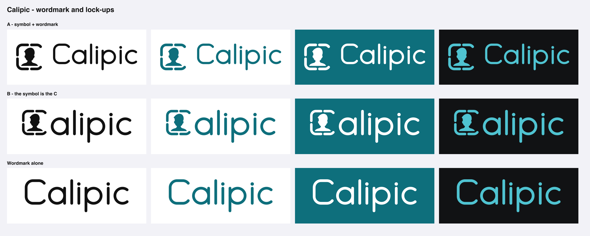

# Calipic — Wordmark and lock-ups (candidate)

**Status:** Accepted by the founder 2026-09-17 (BD-039): integrated lock-up primary, 36-unit stroke  
**Date:** 2026-09-17  
**Handoff step:** 5 — only after symbol and colour are stable (frame accepted, teal accepted)  
**Command:** `scripts/brand/build-wordmark.py` (stdlib + inkscape; imports the symbol geometry from `build-icon-v2.py`)

---

## 1. Approach

The handoff asks for a wordmark that is **not** an over-stylised display piece: the symbol carries the identity and system typography stays the in-product baseline (BD-003, BD-021).

The wordmark is therefore **drawn, not typeset**. Every letter of "Calipic" is built from the same three things as the icon's frame: circular bowls, straight stems, one uniform stroke with round caps. Consequences:

- no font, so nothing to license (SF may not be used in a logo outside Apple's own templates) and nothing that can drift between tools;
- the capital **C is the icon's frame** — a rounded square whose right corners stop after 52°, exactly as in the symbol — so wordmark and symbol are visibly one system;
- the final **c** repeats the same 52° opening on a circle;
- single-storey **a**, and a **p** whose descender mirrors the ascender of the **l**, keep the word calm and symmetrical.

---

## 2. Construction (centre-line units)

| Parameter | Value | Note |
|---|---|---|
| Bowl radius `R` | 100 | x-height = 2R |
| Stroke `W` | 36 | uniform, round caps; equals the symbol's stroke when the symbol is set at cap height |
| Cap height / ascender `CAP` | 300 | descender of p = CAP − 2R, mirroring the ascender |
| Opening `OPEN` | 52° | same sweep as the frame's right corners |
| Letter gap `GAP` | 58 | between outer edges; round-to-round pairs sit slightly tighter |
| i-dot | radius 0.62 W, centred 1.55 W above the x-height | |
| Clear space | ½ cap height on every side | built into the exported SVGs |

---

## 3. Lock-ups

- **A — symbol + wordmark** (`assets/calipic-lockup-horizontal.svg`): the safe, conventional lock-up. The symbol spans ascender to descender. Slight redundancy: two C-frames sit side by side.
- **B — integrated** (`assets/calipic-lockup-integrated.svg`): the symbol **is** the capital C — "[symbol]alipic". This is the most ownable form and it makes the brand idea (a portrait frame that reads as C) explicit without explanation. Stroke weights match by construction. Risk: at very small widths the bust fills in and the C reads as a solid block; at ~110 px wide it is still legible (`wordmark/integrated-ink-110w.png`), below that use the wordmark alone.
- **Stacked** (`assets/calipic-lockup-stacked.svg`): symbol above wordmark for square spaces.
- **Wordmark alone** (`assets/calipic-wordmark.svg`).

**Recommendation:** B as the primary lock-up for marketing, website and App Store imagery; A where the symbol must stay separable (e.g. next to an app icon); wordmark alone for tight horizontal spaces. The app icon itself never carries the wordmark.

**Descriptor:** "Calipic — ID Photos" (BD-028) sets the descriptor as *text*, not as part of the drawn mark: system font on Apple surfaces, regular weight, secondary colour, cap height ≈ 40 % of the wordmark's x-height, left-aligned under the word. It is localisable; the name is not.

---

## 4. Colourways

Ink `#111111` on light, teal `#0E6F7C` on light, white on teal, light teal `#4FC3D1` on near-black. Never two brand colours inside one mark; never a gradient in the wordmark (the finished app icon is the only place with depth).

---

## 5. Decisions and what remains

1. Primary lock-up: **B, integrated** — accepted.
2. Stroke weight: **36** — accepted.
3. Still open: a designer's optical pass (overshoot of round letters, spacing of "l i"). The rounded-square capital C stands.
